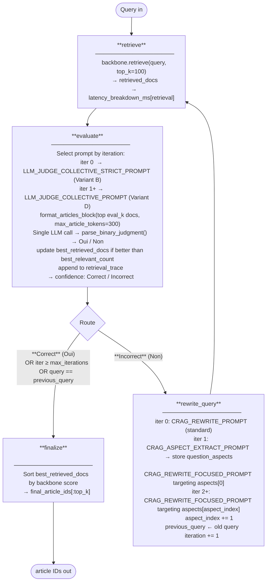
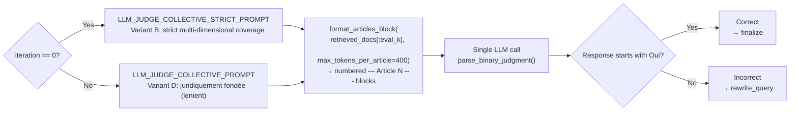

# Tier 4.1 — Agentic CRAG: Implementation & Results
**BSARD RAG Thesis | RQ1 | Tier 4 in thesis framing**

---

## Status

**Complete.** Two test-split runs executed from the Azure notebooks ([azure_tier41_crag.ipynb](azure_notebooks/azure_tier41_crag.ipynb), [azure_tier41_crag_hybrid.ipynb](azure_notebooks/azure_tier41_crag_hybrid.ipynb)). Both run via `python scripts/evaluation/tier4/run_crag_experiments.py --split test --variant {bm25, hybrid_rrf_k60} --max-iterations 6` with `eval_k=20` and the LLaMA 3.1 8B collective evaluator.

| Experiment | Backbone | R@10 | R@100 | MRR@10 | Lat (s) | Notebook | Role |
|---|---|---|---|---|---|---|---|
| **`crag_hybrid_rrf_k60_test_v2`** | hybrid_rrf_k60 (T3-A) | **0.4263** | **0.6542** | **0.3938** | 13.9 | `azure_tier41_crag_hybrid.ipynb` | **Canonical T4.1** (p = 0.046 vs T3-A) |
| `crag_bm25_test_v2` | bm25_tuned_k11.5_b0.25 (T1) | 0.3012 | 0.5238 | 0.3322 | 17.3 | `azure_tier41_crag.ipynb` | First-stage ablation |

**Canonical T4.1 result:** `crag_hybrid_rrf_k60_test_v2` (R@10 = 0.4263). It beats the T3-A non-LLM hybrid baseline by +0.024 R@10 (significant, p = 0.046) but does **not** significantly beat the matched-pool T4.0-hybrid-top20 non-agentic LLM-rerank (R@10 = 0.4347; Δ = −0.008, p ≈ 0.16). The headline thesis finding is therefore: **CRAG's correction loop adds significant value over no-LLM baselines, but at matched pool size it is not significantly better than a single-pass non-agentic LLM re-rank.**

---

## 0. Context and Anchors from Prior Tiers

### 0.1 Shared infrastructure (reused unchanged)

| File | Purpose |
|---|---|
| `evaluation/runner.py` | `run_experiment()`, `save_result()`, `add_significance()` — metric computation and significance testing delegate to external `bsard_evaluation` package |
| `evaluation/split.py` | `load_questions("test"|"val"|"train")` |
| `evaluation/stratify.py` | `load_strata()` |
| `evaluation/split_ids.json` | Persisted train/val/test split (seed=42) |
| `evaluation/query_strata.json` | Per-question strata |
| `output/bsard_articles_dedup.parquet` | Canonical corpus — 22,633 articles |
| `retrieval/sparse.py` | `BM25Retriever` |
| `retrieval/dense.py` | `DenseRetriever` |
| `retrieval/hybrid.py` | `HybridRetriever` *(from Tier 3)* |

### 0.2 Evaluation split

- **Test:** 222 questions — the only split used for Tier 4.1 experiments.

### 0.3 Key results locked in from prior tiers

| Anchor | Configuration | R@10 | R@100 | MRR@10 | Used as |
|---|---|---|---|---|---|
| T1 BM25 | `bm25_tuned_k11.5_b0.25` | 0.2651 | 0.5210 | 0.2628 | CRAG sparse backbone + BM25 anchor for significance |
| T3-A hybrid | `hybrid_rrf_k60` | 0.4021 | 0.6513 | 0.3402 | CRAG hybrid backbone + primary T4.1 anchor |
| T4.0-hybrid top-20 | `llm_rerank_binary_top20_hybrid_rrf_k60_test` | 0.4347 | 0.4648 | 0.3939 | Matched-pool agentic-value anchor (`eval_k=20` = `top_n=20`) |

`eval_k = 20` was chosen up-front to match the T4.0-hybrid top-20 matched-pool comparison; it also provides a comfortable margin above the mean of 6.18 relevant articles per BSARD question and produces ~96 % Correct first-pass / 0 % limit-termination in the runs (see §4.4).

---

## 1. Overview

CRAG (Corrective Retrieval-Augmented Generation; Yan et al., 2024) wraps any retrieval
backbone with a correction loop: an evaluator makes a **collective sufficiency judgment** on
the top-`eval_k` retrieved documents and, based on the result, either accepts the retrieval
(Correct) or rewrites the query (Incorrect) for another pass. In the closed BSARD domain,
the original "Incorrect" web-search fallback is replaced by query rewriting + re-retrieval
from the corpus — a thesis contribution.

**Evaluator (primary):** LLaMA 3.1 8B via `OllamaClient`. A single collective LLM call per
iteration judges whether the full context of `eval_k` documents is **legally sufficient** to
answer the question. This is more token-efficient than `eval_k` individual calls and enables
holistic coverage assessment — important for multi-article BSARD questions (mean 6.18 relevant
articles per question; 65.5% of questions require multiple articles).

**Progressive criterion relaxation:**
- **Iteration 0:** Strict multi-dimensional coverage (`LLM_JUDGE_COLLECTIVE_STRICT_PROMPT`,
  Variant B) — rejects the set unless it covers all essential legal aspects of the question.
  Justified: the backbone's first-pass result deserves a high bar.
- **Iterations 1+:** Legally-grounded adequacy (`LLM_JUDGE_COLLECTIVE_PROMPT`, Variant D) —
  accepts the set if it provides a juridically well-grounded answer (`juridiquement fondée`),
  a relative standard anchored to what THIS question needs. Justified: avoids false Non on
  single-article questions after one rewrite attempt; mirrors query relaxation in IR literature
  (Godfrey 1997).

**Routing (binary only):** `Oui` → Correct → finalize; `Non` → Incorrect → rewrite_query.
No Ambiguous class.

**Three-stage query rewriting:**
- **Iteration 0 → rewrite (Incorrect):** Standard statutory rewrite (`CRAG_REWRITE_PROMPT`) —
  reframes the query using Belgian legal vocabulary.
- **Iteration 1 → rewrite (Incorrect):** Extract 3–5 aspects from the **original question**
  once (`CRAG_ASPECT_EXTRACT_PROMPT`); then write a focused query targeting aspect[0]
  (`CRAG_REWRITE_FOCUSED_PROMPT`). Aspect labels (3–6 words) stored in `state["question_aspects"]`.
- **Iterations 2+ → rewrite (Incorrect):** Focused rewrite targeting `question_aspects[aspect_index]`,
  incrementing `aspect_index` each time. Previously explored aspects passed as compact labels,
  not full query texts.

This strategy is grounded in aspect-based retrieval (Liu 2009) and diversified retrieval
(Carbonell & Goldstein 1998): successive rewrites diversify the query space rather than
rephrasing the same question.

**Two backbones, identical CRAG loop:**

| Experiment ID | Backbone | Role |
|---|---|---|
| **`crag_hybrid_rrf_k60_test_v2`** | `hybrid_rrf_k60` (T3-A) | **Canonical T4.1 result** |
| `crag_bm25_test_v2` | `bm25_tuned_k11.5_b0.25` (T1) | First-stage ablation (same loop, weaker pool) |

The LLM backbone (LLaMA 3.1 8B via Ollama, temperature 0.0) is **identical across all Tier 4 experiments**, including T4.0 LLM-rerank and T4.2 ReAct. The only axis of variation between Tier 4.0 and T4.1 / T4.2 is the agentic mechanism; the axis of variation between `crag_bm25_test_v2` and `crag_hybrid_rrf_k60_test_v2` is the first-stage candidate pool.

---

## 1.5 Architecture Diagrams

### 1.5.1 LangGraph — CRAG StateGraph (high level)



### 1.5.2 Evaluate node — collective sufficiency logic



**eval_k = 20** (locked; no calibration run required — see §10 Decision Log).
`max_article_tokens = 400` whitespace tokens per article → ~8,000 tokens total for 20 articles.
`parse_binary_judgment()` is unchanged — checks whether first word of response is "Oui" or "Non".

### 1.5.3 State fields — what each node reads / writes

```
CRAGState field            retrieve  evaluate  rewrite  finalize
──────────────────────────────────────────────────────────────────
query                        R          R        W          R
original_query               —          R        R          —
previous_query               R          R        W          —
iteration                    R          R        W          —
retrieved_docs               W          R        —          —
best_retrieved_docs          —          RW       —          R
best_relevant_count          —          RW       —          —
confidence                   —          W        R          R
question_aspects             —          —        RW         —
aspect_index                 —          —        RW         —
retrieval_trace              —          W        —          R
latency_breakdown_ms         W          W        W          —
  [retrieval]                W          —        —          —
  [evaluator_llm]            —          W        —          —
  [rewrite_llm]              —          —        W          —
final_article_ids            —          —        —          W

R = reads   W = writes   RW = reads then conditionally writes
```

**`question_aspects`:** list of 3–5 aspect labels (3–6 words each) extracted from the
**original question** by `CRAG_ASPECT_EXTRACT_PROMPT` when iteration 1 rewrite fires.
Initialised to `[]`; populated lazily on first use.

**`aspect_index`:** integer tracking which aspect to target next. Initialised to `0`;
incremented each time a focused rewrite fires. Wraps around (modulo) if exhausted.

### 1.5.4 Best-seen tracking across iterations

With collective judgment, `best_relevant_count` is binary: **1** = collective Oui (Correct),
**0** = collective Non (Incorrect). Sentinel value at initialisation: **-1**.

```
Iteration 0:  retrieve → collective LLM → Non (Incorrect)
              → best_relevant_count = 0  (0 > -1 sentinel → updated)
              → best_retrieved_docs = [D1, D2, …]   ← iteration 0 docs kept as fallback
              ↓ Incorrect → rewrite_query
Iteration 1:  retrieve → collective LLM → Oui (Correct)
              → best_relevant_count = 1  (1 > 0 → updated)
              → best_retrieved_docs = [D3, D4, …]   ← updated
              ↓ Correct → finalize (uses iteration 1 docs)

Tie-break (both Correct):
Iteration 0:  collective → Oui → best_relevant_count = 1
Iteration 1:  collective → Oui → 1 == 1 → NOT updated (iteration 0 wins tie-break)
              finalize: uses iteration 0 docs (first seen, unbiased)

Degraded last iteration:
Iteration 0:  collective → Oui → best_relevant_count = 1
Iteration 1:  collective → Non → 0 < 1 → NOT updated
              finalize: uses iteration 0 docs → prevents regression
```

---

## 2. Modules

### 2.1 `retrieval/agentic/__init__.py`

Package init for `retrieval/agentic/`.

### 2.2 `retrieval/agentic/llm_eval_prompts.py` (shared with T4.0 and T4.2)

This module is shared with Tier 4.0. The evaluator is LLaMA 3.1 8B collective judgment, unified across all Tier 4 experiments. The module provides:

```python
LLM_JUDGE_BINARY_PROMPT: str        # Few-shot binary relevance prompt (French) — T4.0 / T4.2 use
LLM_JUDGE_0TO10_PROMPT: str         # 0-10 numeric scoring (used by T4.0 scoring-paradigm ablation)

# CRAG-specific: collective sufficiency prompts (added for T4.1)
LLM_JUDGE_COLLECTIVE_STRICT_PROMPT: str
# Iteration 0 — Variant B: strict multi-dimensional coverage.
# Template: {question} + {articles_block}
# Asks: do these articles collectively cover ALL essential legal aspects of the question?
# Criteria: completeness of coverage across all legal dimensions raised.
# Response format: "Oui" / "Non" as first word, then brief justification.

LLM_JUDGE_COLLECTIVE_PROMPT: str
# Iterations 1+ — Variant D: legally-grounded adequacy (juridiquement fondée).
# Template: {question} + {articles_block}
# Asks: do these articles collectively provide a juridically well-grounded answer?
# Criterion: is the primary legal basis sufficient to answer THIS specific question?
# Response format: "Oui" / "Non" as first word, then brief justification.
# Less strict than STRICT variant: a single relevant article suffices for single-article questions.

def format_articles_block(
    article_texts: list[str],
    max_tokens_per_article: int = 300,
) -> str:
    """
    Format a list of article texts as a numbered block for the collective prompt.

    Each article is truncated to max_tokens_per_article whitespace-split tokens.
    Returns:
        --- Article 1 ---
        <truncated text>

        --- Article 2 ---
        <truncated text>
        ...
    Total tokens: ~max_tokens_per_article * len(article_texts) (e.g. 3000 for 10 × 300).
    """

def load_fewshot_examples(path: str = "evaluation/agentic/fewshot_examples.json") -> dict:
    """Load locked few-shot examples from train split."""

def parse_binary_judgment(response: str) -> tuple[bool, float]:
    """
    Returns (is_relevant, confidence).
    "Oui" (first word, case-insensitive) → (True, 1.0)
    Anything else → (False, 0.0), logged as parse failure.
    Works for both individual and collective judgment responses.
    """

def parse_numeric_score(response: str) -> float:
    """Extract first number from response, clamped to [0, 10]. Returns 0.0 on failure."""
```

**Note on few-shot examples:** `LLM_JUDGE_COLLECTIVE_STRICT_PROMPT` and
`LLM_JUDGE_COLLECTIVE_PROMPT` use **zero-shot** instructions (no few-shot examples in the
prompt). The collective judgment task is sufficiently different from per-document judgment
that repurposing T4.0 few-shot examples would be misleading. Zero-shot is the documented
choice; disclose in thesis.

### 2.3 `retrieval/agentic/llm_client.py`

OllamaClient wrapper — a single implementation in `llm_client.py`, imported by both
`crag.py` and `react.py` (shared with ReAct, Tier 4.2).

```python
class OllamaClient:
    """
    Thin wrapper around the Ollama REST API.
    generate(prompt, temperature, max_tokens) -> (text, latency_ms)
    preflight() -> latency_ms  (verifies Ollama is reachable and model is loaded)
    """
    def __init__(self, model: str = "llama3.1:8b", base_url: str = "http://localhost:11434"):
        ...

    def generate(self, prompt: str, temperature: float = 0.0, max_tokens: int = 128) -> tuple[str, float]:
        ...

    def preflight(self) -> float:
        """Send a minimal test prompt; return latency_ms. Raises ConnectionError if unreachable."""
        ...
```

Pre-flight: `curl http://localhost:11434/api/tags` must list `llama3.1:8b`.

### 2.4 `retrieval/agentic/prompts.py`

All CRAG prompt templates as module-level constants. **All prompts in French.** Do not embed
prompts inline in `crag.py`.

```python
# ── Iteration 0 rewrite: standard statutory rewrite ────────────────────────
CRAG_REWRITE_PROMPT = """..."""
# Placeholders: {original_query}, {current_query}
# Instructs: rewrite using precise Belgian legal terminology or a different angle.
# Output: plain French query string, no preamble.

# ── Aspect extraction (lazy, fired once when iteration 1 rewrite triggers) ──
CRAG_ASPECT_EXTRACT_PROMPT = """..."""
# Placeholder: {question}
# Instructs: identify 3–5 distinct legal dimensions or sub-questions raised by the question
#   SOLELY based on what the question asks — do not draw on general Belgian law knowledge.
# Output format (structured):
#   1. <aspect label — 3-6 words>
#   2. <aspect label — 3-6 words>
#   ...
# Aspect labels are compact (3-6 words): e.g. "droit de recours administratif",
#   "obligation de motivation de l'acte", "délai de prescription".

# ── Iteration 1 focused rewrite ──────────────────────────────────────────────
CRAG_REWRITE_FOCUSED_PROMPT = """..."""
# Placeholders: {original_query}, {previous_aspects_block}, {target_aspect}
# Instructs: write a query that specifically targets {target_aspect} of the original question,
#   while avoiding the aspects already explored in {previous_aspects_block}.
# Output format (structured — two lines):
#   Aspect ciblé : <3-6 word label>
#   Requête : <plain French query>
# The "Aspect ciblé" label is extracted and stored; "Requête" is the new query.

# ── Kept for reference — not active in binary routing ───────────────────────
CRAG_DECOMPOSE_PROMPT = """..."""
# Original Ambiguous-path prompt. Retained as historical reference.
# NOT used in the current binary routing design.


def parse_aspect_rewrite(response: str) -> tuple[str, str]:
    """
    Parse the two-line structured output of CRAG_REWRITE_FOCUSED_PROMPT.

    Returns (aspect_label, query_text).
    - Looks for lines starting with "Aspect ciblé :" and "Requête :" (case-flexible).
    - Fallback: if format not followed, returns ("unknown_aspect", response.strip())
      so the loop can continue without crashing.
    """

def build_previous_aspects_block(
    original_query: str,
    retrieval_trace: list[dict],
    max_original_words: int = 8,
) -> str:
    """
    Build the {previous_aspects_block} for CRAG_REWRITE_FOCUSED_PROMPT.

    Content:
    - Original query truncated to max_original_words words (compact reference)
    - Aspect labels from retrieval_trace (extracted by parse_aspect_rewrite)
      — one per line, in iteration order

    Example output:
        Requête originale : droit de résiliation du locataire
        Aspects déjà explorés :
          - délai de préavis légal
          - motifs valables de résiliation
    """
```

### 2.5 `retrieval/agentic/crag.py`

LangGraph `StateGraph` implementing the CRAG correction loop. Key contracts:

**State:**

```python
class CRAGState(TypedDict):
    query:                str
    original_query:       str
    previous_query:       str          # loop-detection guard
    iteration:            int
    retrieved_docs:       list[tuple[int, float]]  # (article_id, backbone_score)
    best_retrieved_docs:  list[tuple[int, float]]  # best-seen docs
    best_relevant_count:  int          # binary 0/1; sentinel -1 at init
    confidence:           str          # "Correct" | "Incorrect"
    question_aspects:     list[str]    # aspect labels extracted from original question
    aspect_index:         int          # which aspect to target next in focused rewrite
    retrieval_trace:      list[dict]   # one entry per iteration
    latency_breakdown_ms: dict         # keys: retrieval, evaluator_llm, rewrite_llm
    final_article_ids:    list[int]
```

**Nodes (4 total — `decompose_query` removed; binary routing only):**

1. **`retrieve`** — calls `retriever.retrieve(state["query"], top_k=backbone_top_k)`;
   populates `retrieved_docs` as `[(article_id, backbone_score), ...]`;
   accumulates `latency_breakdown_ms["retrieval"]`

2. **`evaluate`** — collective LLM sufficiency judgment:
   - Select prompt: `iteration == 0` → `LLM_JUDGE_COLLECTIVE_STRICT_PROMPT` (Variant B);
     `iteration > 0` → `LLM_JUDGE_COLLECTIVE_PROMPT` (Variant D)
   - Format top-`eval_k` docs via `format_articles_block(texts, max_article_tokens=300)`
   - Single `OllamaClient.generate()` call
   - Parse response with `parse_binary_judgment()` → `is_correct`
   - `relevant_count = 1 if is_correct else 0`
   - Update `best_retrieved_docs` if `relevant_count > best_relevant_count`
   - Tie-break: equal count keeps iteration 0 docs (sentinel -1 < 0 ensures first update always fires)
   - Accumulates `latency_breakdown_ms["evaluator_llm"]`
   - Appends to `retrieval_trace`

3. **`rewrite_query`** — three-mode LLM rewrite:
   - **`iteration == 0`:** `CRAG_REWRITE_PROMPT(original_query, current_query)` → plain query
   - **`iteration == 1` and `question_aspects == []`:** fire `CRAG_ASPECT_EXTRACT_PROMPT(original_query)`;
     parse numbered list → store in `state["question_aspects"]`;
     then fire `CRAG_REWRITE_FOCUSED_PROMPT(original_query, previous_aspects_block, aspects[0])`;
     parse via `parse_aspect_rewrite()` → `(aspect_label, new_query)`;
     `aspect_index = 1`
   - **`iteration >= 2` (or aspects already populated):** fire `CRAG_REWRITE_FOCUSED_PROMPT`
     targeting `aspects[aspect_index % len(aspects)]`; `aspect_index += 1`
   - Updates `previous_query` ← old query; `query` ← new query; `iteration += 1`
   - Accumulates `latency_breakdown_ms["rewrite_llm"]`

4. **`finalize`** — backbone-score ordering only:
   - Sort `best_retrieved_docs` by backbone score descending
   - `final_article_ids = [doc_id for doc_id, _ in sorted_docs[:top_k]]`
   - No Oui/Non grouping (collective judgment does not label individual docs)

**Graph routing (binary only — no Ambiguous class):**
- `evaluate` → `finalize` if `confidence == "Correct"` OR `iteration >= max_iterations`
  OR `query == previous_query`
- `evaluate` → `rewrite_query` if `confidence == "Incorrect"`
- `rewrite_query` → `retrieve` (iteration already incremented)

**Public interface:**
```python
class CRAGRetriever:
    """
    Drop-in retriever matching RetrieverProtocol.
    retrieve(query, top_k=100) -> (ranked_article_ids, latency_ms)
    """
    def __init__(
        self,
        retriever,                       # Any Tier 1–3 retriever implementing .retrieve()
        df_articles: pd.DataFrame,       # Pre-loaded; indexed by article_id
        llm_client: OllamaClient,        # Used for BOTH evaluation and query rewriting
        eval_k: int = 20,                # Docs judged per iteration (locked; see §10)
        max_iterations: int = 6,         # Hard loop limit (0.0% termination observed in test run)
        backbone_top_k: int = 100,       # Retrieve this many before evaluate+finalize
        fewshot_examples: dict = None,   # Loaded from fewshot_examples.json; passed to prompts
        max_article_tokens: int = 400,   # Per-article token budget for LLM evaluation
    ): ...

    def retrieve(self, query: str, top_k: int = 100) -> tuple[list[int], float]: ...
    def get_latency_breakdown_mean(self) -> dict: ...  # mean across all queries in last run
    def get_loop_stats(self) -> dict: ...               # loop statistics for result JSON
```

---

## 3. Parameter Choices (No Calibration Run)

`eval_k = 20` was fixed up-front for two reasons:
1. It matches the T4.0-hybrid `top_n=20` matched-pool design, enabling a clean agentic-vs-non-agentic comparison at the same candidate-pool size.
2. It provides a comfortable margin above the mean of 6.18 relevant articles per BSARD question, giving the LLM sufficient context for holistic coverage judgment.

No separate calibration sweep over `eval_k` was run; the value was treated as a design decision rather than a tuned hyperparameter. The in-run telemetry validated the choice post-hoc: 96.4 % Correct first-pass on the hybrid backbone and 89.6 % on BM25, with 0 % limit-termination on both (see §4.4).

The orchestrator [scripts/evaluation/tier4/run_crag_experiments.py](scripts/evaluation/tier4/run_crag_experiments.py) exposes `--eval-k` for future ablation but the canonical runs both use `--eval-k 20`.

---

## 4. Experiments

Both runs are on the 222-question BSARD test split, with `eval_k=20`, `max_iterations=6`, LLaMA 3.1 8B collective evaluator, progressive criterion relaxation, and aspect-based focused rewrite.

### 4.1 Locked parameters

| Parameter | Value | Basis |
|---|---|---|
| `eval_k` | 20 | Matches the T4.0-hybrid top-20 matched-pool design; comfortable margin above the mean 6.18 relevant articles per question. |
| `max_article_tokens` | 400 | ~8 000 total tokens for 20 articles; fits LLaMA context; covers longer statutory articles. |
| `backbone_top_k` | 100 | Full candidate pool from which `eval_k=20` is judged. |
| `max_iterations` | 6 | 0.0 % limit-termination observed on both backbones (see §4.4); the hard limit never binds. |
| `temperature` | 0.0 | Deterministic; consistent with all Tier 4 experiments. |
| Iter-0 prompt | `LLM_JUDGE_COLLECTIVE_STRICT_PROMPT` (Variant B) | Strict multi-dimensional coverage. |
| Iter-1+ prompt | `LLM_JUDGE_COLLECTIVE_PROMPT` (Variant D) | Legally-grounded adequacy (progressive relaxation). |

### 4.2 Experiment table

| Experiment ID | Backbone | R@10 | R@100 | MRR@10 | Lat (s) | Notebook | Role |
|---|---|---|---|---|---|---|---|
| **`crag_hybrid_rrf_k60_test_v2`** | hybrid_rrf_k60 (T3-A) | **0.4263** | **0.6542** | **0.3938** | 13.9 | `azure_tier41_crag_hybrid.ipynb` | **Canonical T4.1** |
| `crag_bm25_test_v2` | bm25_tuned_k11.5_b0.25 (T1) | 0.3012 | 0.5238 | 0.3322 | 17.3 | `azure_tier41_crag.ipynb` | First-stage ablation (same loop, weaker pool) |

Both runs invoke `scripts/evaluation/tier4/run_crag_experiments.py --split test --variant {bm25|hybrid_rrf_k60} --max-iterations 6` and load `--eval-k 20`. The only axis of variation between the two is the first-stage retriever.

### 4.3 Significance tests — observed values

All paired t-tests on per-query Recall@10 (two-sided).

| Comparison | T4.1 R@10 | Anchor R@10 | Δ R@10 | p (R@10) | Verdict |
|---|---|---|---|---|---|
| **`crag_hybrid_rrf_k60_test_v2` vs `hybrid_rrf_k60` (T3-A)** | **0.4263** | 0.4021 | **+0.0242** | **0.0463** | **CRAG significantly beats no-LLM hybrid baseline** |
| `crag_hybrid_rrf_k60_test_v2` vs `crag_bm25_test_v2` | 0.4263 | 0.3012 | +0.1251 | **< 0.001** | First-stage pool quality dominates the loop |
| `crag_hybrid_rrf_k60_test_v2` vs `llm_rerank_binary_top20_hybrid_rrf_k60_test` (T4.0-hybrid top-20, matched pool) | 0.4263 | 0.4347 | −0.0084 | 0.16 | **Agentic loop NOT significantly better than non-agentic LLM re-rank at matched pool size** |
| `crag_bm25_test_v2` vs `bm25_tuned_k11.5_b0.25` (T1) | 0.3012 | 0.2651 | +0.0361 | not preserved* | CRAG lifts BM25 modestly |

*The `crag_bm25_test_v2` JSON's `significance_vs_anchor` block has `p_value_recall10: None` — the anchor's `_raw_results` were not available at run time. The R@10 delta is shown for reference.

Result-JSON keys: `significance_vs_anchor.p_value_recall10` (primary anchor) and `secondary_significance.{vs_...}.p_value_recall10` (additional anchors).

### 4.4 CRAG loop behaviour

From the `crag_loop_stats` block in each result JSON:

| Metric | Hybrid (canonical) | BM25 (ablation) |
|---|---|---|
| Mean iterations / query | 1.04 | 1.16 |
| Correct first-pass | **96.4 %** | 89.6 % |
| Rewritten ≥1 | 3.6 % | 10.4 % |
| Hit iteration limit | 0.0 % | 0.0 % |
| Final routing dist. (Correct / Incorrect) | 96.1 / 3.9 % | 85.6 / 14.4 % |

The LLaMA collective evaluator accepts most candidate sets on the first pass on both backbones, and `max_iterations=6` never binds.

### 4.5 Per-iteration rewrite analysis

From the `per_iteration_recall` block in each result JSON:

| Metric | Hybrid (canonical) | BM25 (ablation) |
|---|---|---|
| Queries with ≥ 1 rewrite | 9 | 35 |
| Fraction improved after rewrite | 11.1 % | 5.7 % |
| Fraction unchanged after rewrite | 77.8 % | 80.0 % |
| Fraction regressed after rewrite | 11.1 % | 14.3 % |
| Mean Recall delta within eval_k after rewrite | **+0.0119** | **−0.0398** |

The rewrite mechanism does almost nothing on the strong hybrid pool (only 9 queries are ever rewritten; ~78 % of rewrites leave recall unchanged) and is marginally harmful on the weaker BM25 pool (more queries are rewritten, but the mean recall change inside the eval_k window is negative). Both runs preserve `best_seen` articles across iterations, so within-eval_k regressions don't reach the final ranking — but the upside of the correction loop is genuinely small. The CRAG advantage over T3-A is mostly explained by the LLM evaluator pruning to the top-`eval_k` rather than by rewrite-driven re-retrieval.

### 4.6 Stratified breakdown — canonical `crag_hybrid_rrf_k60_test_v2`

| Stratum | R@10 | R@100 |
|---|---|---|
| Lexically aligned | 0.6943 | 0.9164 |
| Semantically paraphrased | 0.1595 | 0.3897 |
| Single-article | 0.6265 | 0.7952 |
| Multi-article | 0.3068 | 0.5699 |
| With cross-references | 0.4450 | 0.6611 |
| Without cross-references | 0.3411 | 0.6224 |

Vs T3-A `hybrid_rrf_k60` on the same strata:
- Lexically aligned: 0.6943 (CRAG) vs 0.7164 (T3-A) — CRAG slightly **worse** on the easy stratum.
- Semantically paraphrased: 0.1595 (CRAG) vs 0.1349 (T3-A) — CRAG **+0.025** on the hard stratum.

The CRAG correction loop gives a small but consistent boost on the semantic-paraphrase stratum (where rewriting can plausibly help) and a small drag on the lexically-aligned stratum (where rewriting can plausibly hurt by pulling the query off-topic). The net is the +0.024 R@10 reported in §4.3.

### 4.7 Latency

| System | Mean latency / query | Notes |
|---|---|---|
| `crag_hybrid_rrf_k60_test_v2` | **13.9 s** | 96.4 % Correct first-pass → fewer LLM calls |
| `crag_bm25_test_v2` | 17.3 s | 10.4 % rewritten → more iterations on average |

Latency breakdown (from `latency_breakdown_ms_mean`): on the canonical run, evaluator-LLM = 13 401 ms / query, retrieval = 419 ms, rewrite-LLM = 72 ms. The evaluator call dominates.

---

## 5. File and Folder Layout

```
retrieval/
└── agentic/
    ├── __init__.py
    ├── crag.py                        ← CRAGRetriever + LangGraph StateGraph + node functions
    ├── llm_client.py                  ← OllamaClient (shared with ReAct and T4.0/T4.2)
    ├── llm_eval_prompts.py            ← LLM_JUDGE_BINARY_PROMPT (T4.0/T4.2),
    │                                     LLM_JUDGE_COLLECTIVE_STRICT_PROMPT (T4.1 iter 0),
    │                                     LLM_JUDGE_COLLECTIVE_PROMPT (T4.1 iter 1+),
    │                                     format_articles_block(),
    │                                     parse_binary_judgment(), load_fewshot_examples()
    └── prompts.py                     ← CRAG_REWRITE_PROMPT,
                                          CRAG_ASPECT_EXTRACT_PROMPT,
                                          CRAG_REWRITE_FOCUSED_PROMPT,
                                          CRAG_DECOMPOSE_PROMPT (reference only),
                                          parse_aspect_rewrite(),
                                          build_previous_aspects_block()

scripts/
└── evaluation/
    └── tier4/
        ├── select_fewshot_examples.py     ← locks few-shot examples from train split (T4.0 plan)
        └── run_crag_experiments.py        ← supports --split {val,test,all} and
                                              --variant {bm25,hybrid_rrf_k60,dense,all};
                                              the canonical runs invoke --split test with
                                              --variant bm25 and --variant hybrid_rrf_k60.

evaluation/
└── data/
    └── fewshot_examples.json          ← locked few-shot examples (in git; used by T4.0/T4.2)

azure_notebooks/
    ├── azure_tier41_crag.ipynb              ← runs crag_bm25_test_v2
    └── azure_tier41_crag_hybrid.ipynb       ← runs crag_hybrid_rrf_k60_test_v2

output/results/agentic/CRAG/           ← under the data root (NOT in git)
    ├── crag_bm25_test_v2.json               ← first-stage ablation
    └── crag_hybrid_rrf_k60_test_v2.json     ← CANONICAL T4.1 result

tests/
└── agentic/
    └── test_crag.py
```

---

## 6. Result JSON Schema

Extends the standard schema (Tier 0 + 1 + 2 conventions). The `evaluation/runner.py`
`run_experiment()` function is used unchanged; CRAG-specific fields go into
`hyperparameters` and a new top-level `crag_loop_stats` block.

```json
{
  "experiment_id": "crag_bm25_test_v2",
  "timestamp": "2026-MM-DDTHH:MM:SS",
  "model_or_method": "cragretriever",
  "hyperparameters": {
    "retrieval_backbone": "bm25_tuned_k11.5_b0.25",
    "evaluator": "llama3.1:8b",
    "llm_backbone": "llama3.1:8b",
    "eval_k": 20,
    "backbone_top_k": 100,
    "max_iterations": 6,
    "max_article_tokens": 400,
    "routing": "binary_collective_llm",
    "evaluator_prompt_iter0": "collective_strict_variant_b",
    "evaluator_prompt_iter1plus": "collective_variant_d"
  },
  "preprocessing": {
    "normalization": "lemmatize",
    "field_weighting": "text_only"
  },
  "token_length_audit": {
    "fraction_truncated": 0.0,
    "max_tokens_observed": 0
  },
  "training_regime": "zero_shot",
  "latency_ms_mean": 0.0,
  "latency_ms_std": 0.0,
  "latency_distribution": {
    "mean": 0.0, "std": 0.0,
    "p50": 0.0, "p90": 0.0, "p95": 0.0, "p99": 0.0,
    "min": 0.0, "max": 0.0,
    "index_build_s": 0.0
  },
  "latency_breakdown_ms_mean": {
    "retrieval": 0.0,
    "evaluator_llm": 0.0,
    "rewrite_llm": 0.0
  },
  "total_experiment_wall_clock_s": 0.0,
  "metrics": {
    "Recall@1": 0.0, "Recall@5": 0.0, "Recall@10": 0.0,
    "Recall@20": 0.0, "Recall@50": 0.0, "Recall@100": 0.0,
    "Recall@200": 0.0, "Recall@500": 0.0,
    "MRR@10": 0.0, "MRR@100": 0.0,
    "NDCG@10": 0.0,
    "MAP": 0.0, "MAP@100": 0.0
  },
  "significance_vs_anchor": {
    "p_value_recall10": null,
    "significant": null
  },
  "stratified": {
    "single_article": {},
    "multi_article": {},
    "lexically_aligned": {},
    "semantically_paraphrased": {},
    "with_cross_refs": {},
    "without_cross_refs": {}
  },
  "crag_loop_stats": {
    "n_queries": 0,
    "mean_iterations_per_query": 0.0,
    "fraction_queries_correct_first_pass": 0.0,
    "fraction_queries_rewritten": 0.0,
    "fraction_queries_terminated_by_limit": 0.0,
    "fraction_queries_no_change_termination": 0.0,
    "fraction_queries_used_aspect_rewrite": 0.0,
    "distribution_Correct": 0.0,
    "distribution_Incorrect": 0.0
  }
}
```

---

## 7. Unit Tests: `tests/agentic/test_crag.py`

16 active tests:

| Test | What it checks |
|---|---|
| `test_collective_judgment_correct` | Single LLM call returning "Oui" → confidence = "Correct" → finalize |
| `test_collective_judgment_incorrect` | Single LLM call returning "Non" → confidence = "Incorrect" → rewrite_query |
| `test_prompt_selection_strict_iter0` | evaluate node selects `LLM_JUDGE_COLLECTIVE_STRICT_PROMPT` at iteration 0 |
| `test_prompt_selection_lenient_iter1plus` | evaluate node selects `LLM_JUDGE_COLLECTIVE_PROMPT` at iteration 1+ |
| `test_aspect_extraction_lazy_on_iter1` | `CRAG_ASPECT_EXTRACT_PROMPT` fires exactly once at iteration 1 rewrite; `question_aspects` populated; `aspect_index = 1` after rewrite |
| `test_focused_rewrite_iter1plus` | `CRAG_REWRITE_FOCUSED_PROMPT` used at iteration ≥ 1; aspect label extracted and stored in trace |
| `test_best_seen_update` | `best_relevant_count` and `best_retrieved_docs` update only when new count > old count |
| `test_best_seen_no_regression` | finalize uses `best_retrieved_docs` not `retrieved_docs` (when last iteration degraded) |
| `test_best_seen_tiebreak` | equal `best_relevant_count` → keeps iteration 0 docs (first seen wins) |
| `test_loop_termination_correct` | Stops at iteration 0 when first-pass is Correct |
| `test_loop_termination_max_iter` | Stops at iteration = max_iterations |
| `test_loop_termination_no_change` | Stops when query == previous_query after rewrite |
| `test_latency_fields_populated` | All three `latency_breakdown_ms` keys > 0 after a loop with one rewrite |
| `test_finalize_backbone_sort_only` | `final_article_ids` ordered by backbone score descending; no Oui/Non grouping |
| `test_french_prompt_output` | LLM generates a non-empty string different from the input query |
| `test_retrieval_trace_length` | `retrieval_trace` has one entry per iteration |

---

## 8. Execution Order — As Run

```
[DONE] T4.0 prerequisites (llm_eval_prompts.py + locked fewshot_examples.json)
[DONE] Tier 3 hybrid_rrf_k60 result available as anchor

Step 1  [DONE] retrieval/agentic/llm_client.py — OllamaClient shared with T4.0 / T4.2
Step 2  [DONE] retrieval/agentic/prompts.py — CRAG_REWRITE_PROMPT,
        CRAG_ASPECT_EXTRACT_PROMPT, CRAG_REWRITE_FOCUSED_PROMPT,
        parse_aspect_rewrite(), build_previous_aspects_block()
Step 3  [DONE] retrieval/agentic/llm_eval_prompts.py — added
        LLM_JUDGE_COLLECTIVE_STRICT_PROMPT, LLM_JUDGE_COLLECTIVE_PROMPT,
        format_articles_block()
Step 4  [DONE] retrieval/agentic/crag.py — LangGraph StateGraph with collective
        evaluate node, three-mode rewrite node, backbone-sort finalize
Step 5  [DONE] tests/agentic/test_crag.py — 16 tests

Step 6  [DONE] azure_tier41_crag.ipynb on Azure GPU:
          python scripts/evaluation/tier4/run_crag_experiments.py
                 --split test --variant bm25 --max-iterations 6
          → crag_bm25_test_v2.json  (R@10 = 0.3012)

Step 7  [DONE] azure_tier41_crag_hybrid.ipynb on Azure GPU:
          python scripts/evaluation/tier4/run_crag_experiments.py
                 --split test --variant hybrid_rrf_k60 --max-iterations 6
          → crag_hybrid_rrf_k60_test_v2.json  (R@10 = 0.4263 — canonical)
          Significant vs T3-A `hybrid_rrf_k60` (p = 0.046); not significant
          vs T4.0-hybrid top-20 (p ≈ 0.16, matched pool).
```

---

## 9. Dependencies

All already satisfied by Tier 1–3, plus:

```
# requirements.txt additions:
langgraph>=0.1.0
langchain-core>=0.2.0
ollama>=0.2.0
```

Ollama setup:
```bash
ollama pull llama3.1:8b
ollama serve
# verify:
curl http://localhost:11434/api/tags
```

No cross-encoder model downloads needed for CRAG. The evaluator is `llama3.1:8b` via
Ollama (same model already required for rewriting). The Tier 3 CE models are used only
in Tier 3 experiments — CRAG v2 has no CE dependency.

---

## 10. Decision Log

| Decision | Value | Rationale |
|---|---|---|
| **Evaluator model (primary)** | `llama3.1:8b` via OllamaClient | Unified with T4.0 and T4.2 — eliminates evaluator confound. Delta T4.1 vs T4.0 = pure CRAG correction loop contribution. |
| **Collective judgment** | Single LLM call evaluating all eval_k docs as a set | Token-efficient (1 call per iteration vs eval_k calls). Enables holistic coverage assessment — critical for multi-article questions (mean 6.18 relevant articles). |
| **Progressive criterion relaxation** | Iter 0: strict Variant B; iter 1+: lenient Variant D (`juridiquement fondée`) | Iter 0 high bar justified by unbiased first-pass. Iter 1+ relaxation prevents false Non on single-article questions after one rewrite. Grounded in Godfrey 1997 IR query relaxation literature. |
| **Aspect-based query diversification** | After first rewrite, target distinct legal dimensions of the original question | Successive rewrites diversify the query space. Grounded in Liu 2009 (aspect-based retrieval) and Carbonell & Goldstein 1998 (diversified retrieval). |
| **Lazy aspect extraction** | `CRAG_ASPECT_EXTRACT_PROMPT` called once at iter 1 rewrite; aspects extracted from question itself | Avoids hallucinating general Belgian law aspects not present in the question. Aspects grounded in what the question actually asks. |
| **Compact aspect labels** | 3–6 word labels in previous_aspects_block (not full query texts) | Token-efficient; reduces noise in rewrite prompt; produced as by-product of `CRAG_REWRITE_FOCUSED_PROMPT` two-line output. |
| **`eval_k`** | 20 | Matches the T4.0-hybrid top-20 matched-pool design and provides comfortable margin above the mean of 6.18 relevant articles per question. No separate calibration sweep — `eval_k=20` was a design decision, validated post-hoc by 96.4 % / 89.6 % Correct first-pass (§4.4). |
| **`max_article_tokens`** | 400 | ~8 000 total tokens for 20 articles; fits LLaMA context; covers longer statutory texts without excessive truncation. |
| **`max_iterations`** | 6 | Post-run: 0.0 % limit-termination on both backbones — the hard limit never bound the loop. |
| **Routing mode** | Binary: `Oui` → Correct → finalize; `Non` → Incorrect → rewrite_query | No Ambiguous class. Collective judgment produces binary output. |
| **Best-seen tie-break** | Equal `best_relevant_count` → keep iteration 0 docs | First retrieval is unbiased; later rewrites may overfit to a specific query phrasing. |
| **Finalize sorting** | Backbone score descending only | Collective judgment does not label individual docs; Oui/Non grouping is not possible. |
| **Zero-shot collective prompts** | `LLM_JUDGE_COLLECTIVE_STRICT_PROMPT` and `LLM_JUDGE_COLLECTIVE_PROMPT` use no few-shot examples | Collective judgment task is sufficiently different from per-doc T4.0 task; repurposing T4.0 few-shot examples would be misleading. |
| **Rewrite recall pattern (observed)** | BM25 rewrites: 80 % unchanged, 14.3 % regressed, 5.7 % improved, mean Δ within eval_k = −0.0398. Hybrid rewrites: 77.8 % unchanged, 11.1 % regressed, 11.1 % improved, mean Δ = +0.0119. Best-seen tracking prevents within-eval_k regression from affecting the final ranking. | Most of CRAG's lift over T3-A comes from the LLaMA evaluator pruning to the top-`eval_k`, not from rewrite-driven re-retrieval. This is a thesis-disclosable finding (see §11). |
| **Canonical = hybrid; BM25 = ablation** | Canonical = `crag_hybrid_rrf_k60_test_v2` on `hybrid_rrf_k60` — identical first stage to T4.0-hybrid. Ablation = `crag_bm25_test_v2` on the T1 BM25 anchor. | Mirrors T4.0: hybrid is canonical, BM25 is the first-stage ablation. All CRAG parameters (`eval_k=20`, `max_iterations=6`, `max_article_tokens=400`) identical across the two; first stage is the only axis of variation. Significance comparisons: canonical vs T3-A `hybrid_rrf_k60`, vs `crag_bm25_test_v2`, vs T4.0-hybrid top-20. |
| **mE5-large (non-instruct) for hybrid backbone** | `intfloat/multilingual-e5-large` (not instruct) — embedding slug `intfloat_multilingual_e5_large_concat_2x` | Matches T4.0-hybrid first stage exactly. Pre-computed embeddings reused from T4.0-hybrid blob storage (`embeddings/intfloat_multilingual_e5_large_concat_2x.npy`). No additional encoding step needed. |

---

## 11. Mandatory Thesis Disclosures (Chapter 4)

The following must appear in the thesis CRAG section.

- **On the unified evaluator:** All Tier 4 experiments (T4.0, T4.1 CRAG, T4.2 ReAct) use
  LLaMA 3.1 8B as the sole relevance scorer. Any performance delta between T4.0 (non-agentic)
  and T4.1/T4.2 (agentic) is attributable to the agentic mechanism, not the scoring model.
- **On collective vs per-document judgment:** CRAG evaluates all `eval_k` documents as a
  collective context rather than scoring each individually. This design choice is motivated by
  the multi-article structure of BSARD (mean 6.18 relevant articles; 65.5% multi-article
  questions) — holistic assessment of coverage is more appropriate than per-document binary
  labels.
- **On progressive criterion relaxation:** Iteration 0 applies a strict multi-dimensional
  coverage criterion (Variant B); subsequent iterations apply a relative adequacy criterion
  (`juridiquement fondée`, Variant D). This mirrors query relaxation strategies in IR (Godfrey
  1997) and prevents false Non on single-article questions after the first rewrite attempt.
- **On aspect-based query diversification:** After the first rewrite, subsequent rewrites
  target distinct legal dimensions of the original question. Aspects are extracted from the
  question itself (not from general Belgian law knowledge) via a one-time LLM call. This
  strategy is grounded in aspect-based retrieval (Liu 2009) and diversified retrieval
  (Carbonell & Goldstein 1998). It is a thesis contribution.
- **On zero-shot collective prompts:** The collective sufficiency prompts use no few-shot
  examples. The BSARD few-shot examples locked in `fewshot_examples.json` were designed for
  per-document T4.0 judgment; repurposing them for collective assessment would be misleading.
  Disclose as zero-shot evaluation.
- **On closed-domain adaptation:** "Incorrect" path uses query rewriting instead of web
  search; this is a thesis contribution.
- **On objective mismatch:** CRAG was designed for generation quality; this thesis
  evaluates retrieval metrics (Recall@k, NDCG). The two objectives are related but not
  identical.
- **On eval_k selection without calibration:** `eval_k=20` was a design decision, not the
  output of a calibration sweep. It provides a comfortable margin above the mean
  relevant-article count (6.18) and matches the T4.0-hybrid `top_n=20` matched-pool design.
  The in-run telemetry confirmed the choice was viable: 96.4 % Correct first-pass on the
  hybrid backbone and 89.6 % on BM25, with 0 % limit-termination on both.
- **On rewrite recall behaviour:** Most queries are accepted on the first pass
  (96.4 % on hybrid, 89.6 % on BM25), so the rewrite mechanism fires rarely. When it does
  fire, ~78 % of rewrites leave eval_k recall unchanged; the mean per-rewrite Δ is +0.0119
  on the hybrid backbone and −0.0398 on the BM25 backbone. Best-seen tracking prevents
  within-eval_k regressions from affecting the final ranking. Most of CRAG's lift over T3-A
  is therefore attributable to the LLaMA evaluator pruning to the top-`eval_k`, not to
  rewrite-driven re-retrieval. Report as a limitation: aspect-based rewrites generate
  queries that diverge enough from the original that lexical-only backbones (BM25) cannot
  benefit.
- **On the agentic-loop value:** At the matched-pool comparison (CRAG `eval_k=20` vs T4.0
  `top_n=20`, identical hybrid first stage, identical LLM), CRAG R@10 = 0.4263 vs T4.0 R@10 =
  0.4347 (Δ = −0.008, p ≈ 0.16). The CRAG correction loop is **not significantly better than
  a single-pass non-agentic LLM re-rank** at matched pool size. Report as the central RQ1
  cost-benefit finding: agentic mechanisms in this corpus do not deliver a significant
  retrieval gain over a simple LLM re-rank, while costing substantially more latency.
- **On binary routing:** The Ambiguous routing class was removed. Binary routing
  (Correct / Incorrect) via collective judgment is the natural design with a binary LLM
  output.
