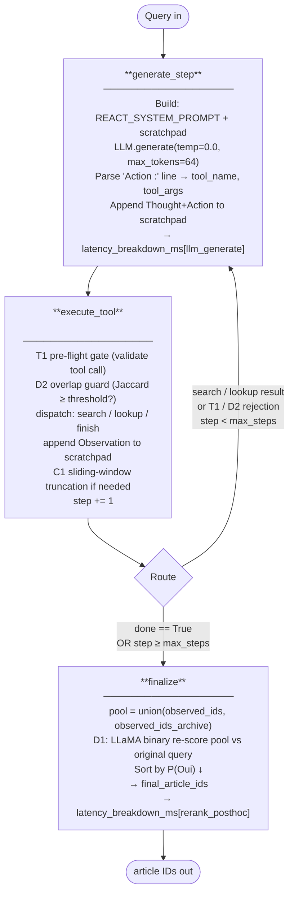
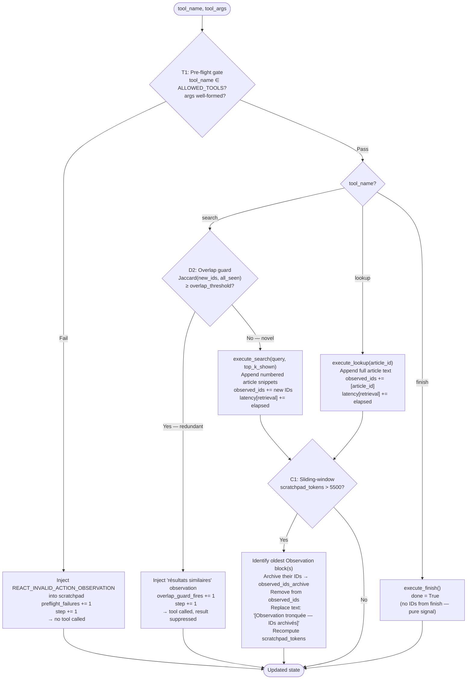

# Tier 4.2 — Agentic ReAct: Implementation & Results
**BSARD RAG Thesis | RQ1 | Tier 4 in thesis framing**

---

## Status

**Complete.** Three test-split runs across two Azure notebooks. The hybrid first stage was run twice — a v1 version with the original hyperparameters that under-performed both first-stage baselines, and a v2 version with revised hyperparameters and design changes that significantly beats T3-A.

| Experiment | Backbone | `max_steps` | `top_k_shown` | `max_article_tokens` | R@10 | R@100 | MRR@10 | Notebook |
|---|---|---|---|---|---|---|---|---|
| `react_bm25_test` | bm25_tuned_k11.5_b0.25 (T1) | 5 | 10 | 200 | 0.2266 | 0.2363 | 0.2201 | `azure_tier42_react.ipynb` |
| `react_hybrid_rrf_k60_test` (v1) | hybrid_rrf_k60 (T3-A) | 5 | 10 | 200 | 0.2771 | 0.2922 | 0.2675 | downloaded from blob; compared in `azure_tier42_react_hybrid.ipynb` Cell 17 |
| **`react_hybrid_rrf_k60_test_v2`** | hybrid_rrf_k60 (T3-A) | 8 | 3 | 300 | **0.4256** | **0.4678** | **0.3738** | `azure_tier42_react_hybrid.ipynb` Cell 10 |

**Canonical T4.2 result:** `react_hybrid_rrf_k60_test_v2` (R@10 = 0.4256, significant vs T3-A at p = 0.027).

**v1 → v2 changes** (locked in [react.py](retrieval/agentic/react.py) and Cell 8 of the hybrid notebook):
- `max_steps`: 5 → 8
- `top_k_shown`: 10 → 3 (narrower observation window forces deeper exploration)
- `overlap_threshold`: 1.1 (effectively disabled) → 0.6 (active overlap guard)
- `max_article_tokens`: 200 → 300
- Added: function-calling action format, robust action-regex v2, invalid-action echo back to LLM, few-shot trajectories, gap prompt, explicit step-budget injection, seed-search at top_k=20 with top-up at threshold=20 → top_k=50

**v1 outcomes (both BM25 and hybrid):** Under-performed their first-stage backbones — BM25 v1 R@10 = 0.2266 < BM25 anchor 0.2651; hybrid v1 R@10 = 0.2771 < T3-A 0.4021 (p < 0.001) and < T4.0-hybrid 0.4451 (p < 0.001). 92.8 % (BM25) / 87.8 % (hybrid) of queries hit the step limit without converging. The v2 fix turned this around for hybrid (R@10 = 0.4256 > T3-A 0.4021, p = 0.027); BM25 was not re-run on v2.

**Architecture document:** [REACT_ARCHITECTURE_v2.md](REACT_ARCHITECTURE_v2.md) (v2.0, 2026-03-24) — the authoritative design reference. This plan is the *implementation checklist*; all rationale lives in the architecture doc. Read the full document before reading the rest of this plan, with special attention to:
- The `finish[done]` stopping signal contract (§finish-semantics): `finish[done]` is a **pure stopping signal**. IDs are extracted deterministically from the observation trace, never recalled by the LLM.
- The sliding-window budget contract (§C1): `MAX_SCRATCHPAD_TOKENS=5500`; dropped observation IDs are archived in `observed_ids_archive`, not discarded.
- The post-hoc re-ranking contract (§D1): the union of `observed_ids` + `observed_ids_archive` is re-scored against the **original query** after `finish[done]`.
- The semantic overlap guard (§D2): Jaccard-based guard prevents redundant retrieval iterations.

---

## 0. Context and Anchors from Prior Tiers

### 0.1 Shared infrastructure (reused unchanged)

| File | Purpose |
|---|---|
| `evaluation/metrics.py` | Recall@k, MRR@k, NDCG@k, MAP@k |
| `evaluation/runner.py` | `run_experiment()`, `save_result()`, `add_significance()` |
| `evaluation/split.py` | `load_questions("test"|"val"|"train")` |
| `evaluation/stratify.py` | `load_strata()` |
| `evaluation/split_ids.json` | Persisted train/val/test split (seed=42) |
| `evaluation/query_strata.json` | Per-question strata |
| `output/bsard_articles_dedup.parquet` | Canonical corpus — 22,633 articles |
| `retrieval/sparse.py` | `BM25Retriever` |
| `retrieval/dense.py` | `DenseRetriever` |
| `retrieval/hybrid.py` | `HybridRetriever`, `CrossEncoderReranker` *(from Tier 3 — Tier 3 only; ReAct does not use CE)* |
| `retrieval/agentic/llm_client.py` | `OllamaClient` — shared with CRAG (implement once) |
| `retrieval/agentic/llm_eval_prompts.py` | `LLM_JUDGE_BINARY_PROMPT`, `parse_binary_judgment()`, `load_fewshot_examples()` — used for D1 post-hoc re-ranking |
| `evaluation/data/fewshot_examples.json` | Locked few-shot examples from train split (shared with T4.0 and T4.1) |
| `retrieval/agentic/prompts.py` | Prompt constants — CRAG prompts already here; add ReAct prompts |

### 0.2 Evaluation split

- **Test:** 222 questions (sole evaluation split — hyperparameters are hardcoded, val not used)

### 0.3 Key results locked in from prior tiers

| Configuration | R@10 | R@100 | MRR@10 | Notes |
|---|---|---|---|---|
| `bm25_tuned_k11.5_b0.25` | 0.2651 | 0.5210 | 0.2628 | **T4.2 backbone — identical to T4.0 first stage** |
| T4.0 LLM rerank (binary top50) | 0.3618 | 0.4630 | 0.3623 | Direct comparison anchor for T4.2 |

**ReAct backbone confirmed:** `BM25Retriever(normalization="lemmatize", field_weighting="text_only", variant="okapi", k1=1.5, b=0.25)` — same as T4.0 first stage.

---

## 1. Overview

ReAct (Reasoning + Acting; Yao et al., 2023) interleaves chain-of-thought reasoning with
tool invocations in a Thought-Action-Observation loop. At each step the LLM emits a
*Thought* (reasoning trace) followed by an *Action* (tool call), then receives an
*Observation* (tool result). The loop terminates when the LLM emits `finish[done]` — a pure
stopping signal; article IDs are extracted deterministically from the accumulated observation
text, not by LLM recall.

**Two backbones in scope:**

| Experiment ID | Backbone | Purpose |
|---|---|---|
| `react_bm25` | `bm25_tuned_k11.5_b0.25` (T1) | ReAct reasoning loop over T4.0-identical first stage |
| `react_hybrid_rrf_k60` | `hybrid_rrf_k60` (T3-A) | ReAct reasoning loop over the T3-A hybrid pool (matched to T4.0-hybrid) |

**Backbone:** `bm25_tuned_k11.5_b0.25` — BM25 Okapi, k1=1.5, b=0.25, normalization=lemmatize,
field_weighting=text_only. **Identical to the T4.0 first-stage retriever.** This is the critical
design choice: T4.2 vs T4.0 comparison isolates the ReAct reasoning loop as the sole variable,
with zero backbone confound.

**RQ1 claim:** Any performance delta between `react_bm25` and `llm_rerank_binary_top50` (T4.0)
is attributable solely to the ReAct multi-step reasoning mechanism — same backbone, same LLM,
same D1 binary scoring. The LLM backbone (LLaMA 3.1 8B via Ollama) is **constant across T4.0
and T4.2**.

---

## 1.5 Architecture Diagrams

### 1.5.1 LangGraph — ReAct StateGraph (high level)



### 1.5.2 execute_tool node — internal logic



### 1.5.3 finalize node — D1 post-hoc re-ranking

```
After finish[done] or step ≥ max_steps:

  observed_ids         = [301, 88, 44, 301, 12]   (current scratchpad window)
  observed_ids_archive = [201, 99]                 (truncated by C1 earlier)

  pool = deduplicate preserving order
       = [301, 88, 44, 12, 201, 99]

  D1 re-ranking (LLaMA 3.1 8B binary judgment):
    LLM_JUDGE_BINARY_PROMPT.format(question=original_query, article_text=truncated_text)
    → parse_binary_judgment() → P("Oui") per article
    → sort by P("Oui") ↓ (or binary: relevant first, then by backbone score)

  final_article_ids = [88, 201, 44, 12, 301, 99]   (LLaMA-ranked against original query)

  Note: original_query is immutable throughout the loop.
        Last search query may be rewritten — do NOT use it for re-ranking.
        D1 uses LLM_JUDGE_BINARY_PROMPT from llm_eval_prompts.py — same few-shot examples
        as T4.0 and T4.1. No CrossEncoderReranker used in ReAct.
```

### 1.5.4 State fields — what each node reads / writes

```
ReActState field            generate_step  execute_tool  finalize
─────────────────────────────────────────────────────────────────
query                             R              R           R
scratchpad                       RW             RW           —
scratchpad_tokens                RW             RW           —
step                              R              W           R
done                              —              W           R
tool_name                         W              R           —
tool_args                         W              R           —
observed_ids                      —             RW           R
observed_ids_archive              —             RW           R
preflight_failures                —              W           R
overlap_guard_fires               —              W           R
latency_breakdown_ms[llm]         W              —           —
latency_breakdown_ms[retrieval]   —              W           —
latency_breakdown_ms[rerank]      —              —           W
agent_loop_trace                  W              W           R
final_article_ids                 —              —           W

R = reads   W = writes   RW = reads then conditionally writes
```

### 1.5.5 Example scratchpad trace (single query, 2 steps)

```
── Step 0 ────────────────────────────────────────────────────────────────────
Pensée : La question porte sur les conditions d'application de l'article 1382.
         Je vais chercher des articles relatifs à la responsabilité civile.
Action : search[responsabilité civile faute dommage lien causal]

Observation :
  [1] ID=4521 — Art. 1382 C.civ. — Tout fait quelconque de l'homme, qui cause à
      autrui un dommage, oblige celui par la faute duquel il est arrivé...
  [2] ID=4522 — Art. 1383 C.civ. — Chacun est responsable du dommage qu'il a
      causé non seulement par son fait, mais encore par sa négligence...
  [3] ID=7801 — Art. 22 L. 25/06/1992 — L'assuré est tenu de déclarer...
  [4] ID=4523 — Art. 1384 C.civ. — On est responsable non seulement du dommage...
  [5] ID=9103 — Art. 3 L. 10/04/1990 — ...

── Step 1 ────────────────────────────────────────────────────────────────────
Pensée : Les articles 1382–1384 sont pertinents. L'article 7801 semble hors sujet.
         Je vais vérifier l'article 4521 pour confirmer.
Action : lookup[4521]

Observation :
  ID=4521 — Texte complet : Tout fait quelconque de l'homme...

── Step 2 ────────────────────────────────────────────────────────────────────
Pensée : J'ai trouvé les articles pertinents : 4521, 4522, 4523, 4524.
Action : finish[done]

── finalize ──────────────────────────────────────────────────────────────────
observed_ids        = [4521, 4522, 7801, 4523, 9103]
observed_ids_archive= []
pool (dedup)        = [4521, 4522, 7801, 4523, 9103]
D1 LLaMA binary re-score vs "conditions d'application de l'article 1382":
  → final_article_ids = [4521, 4523, 4522, 4524, ...]   (sorted by P("Oui") ↓)
```

---

## 2. Modules

### 2.1 `retrieval/agentic/tools.py`

Defines the tool registry used by the `execute_tool` node.

```python
from dataclasses import dataclass
from typing import Protocol

@dataclass
class ToolResult:
    """Structured result from a single tool invocation."""
    tool_name: str            # "search" | "lookup" | "finish"
    raw_text: str             # Formatted text injected into scratchpad as Observation
    article_ids: list[int]    # IDs extracted from this result (empty for finish)
    latency_ms: float         # Wall-clock time for this call

class RetrieverProtocol(Protocol):
    def retrieve(self, query: str, top_k: int) -> tuple[list[int], float]: ...


def execute_search(
    query: str,
    retriever: RetrieverProtocol,
    df_articles,            # pd.DataFrame indexed by article_id
    top_k_shown: int = 5,
) -> ToolResult:
    """
    Calls retriever.retrieve(query, top_k=top_k_shown).
    Formats a numbered list of (article_id, article_text snippet) pairs.
    Returns ToolResult with article_ids populated.
    Snippet length: first 200 characters of article_text to keep observations compact.
    """

def execute_lookup(
    article_id: int,
    df_articles,
) -> ToolResult:
    """
    Returns full article_text for the given article_id.
    Returns ToolResult with article_ids=[article_id].
    If article_id not found: raw_text = "Article non trouvé.", article_ids=[].
    """

def execute_finish() -> ToolResult:
    """
    Pure stopping signal. raw_text = "", article_ids = [].
    The finalize node handles ID consolidation separately.
    """

ALLOWED_TOOLS = {"search", "lookup", "finish"}
```

**Pre-flight validation gate (T1):** All tool calls pass through
`validate_tool_call(tool_name: str, tool_args: dict) -> tuple[bool, str]` before execution.
- Checks `tool_name in ALLOWED_TOOLS`
- For `search`: `tool_args["query"]` is a non-empty string
- For `lookup`: `tool_args["article_id"]` is a valid integer
- On failure: returns `(False, error_message)`; the `execute_tool` node injects the error
  message as an Observation without calling the tool, and increments `step` normally

### 2.2 `retrieval/agentic/prompts.py` (additions)

Add ReAct constants to the existing `prompts.py` that already holds CRAG prompts.

```python
# ReAct system prompt — French statutory context
REACT_SYSTEM_PROMPT = """Vous êtes un agent de recherche juridique spécialisé dans
la législation belge. Votre tâche est de retrouver les articles de loi pertinents
pour répondre à une question donnée.

Vous disposez des outils suivants :
- search[requête] : recherche les articles les plus pertinents pour une requête
- lookup[id] : affiche le texte complet d'un article par son identifiant numérique
- finish[done] : termine la recherche une fois que vous avez trouvé les articles pertinents

À chaque étape, raisonnez d'abord (Pensée), puis agissez (Action).
Format strict :
Pensée : <votre raisonnement>
Action : search[<requête>] | lookup[<id>] | finish[done]

Ne récapitulez pas les identifiants dans l'action finish. Utilisez finish[done] uniquement
comme signal d'arrêt."""

# ReAct user turn template
REACT_USER_TEMPLATE = """Question : {question}

{scratchpad}"""

# Injected when the pre-flight gate rejects a tool call (T1)
REACT_INVALID_ACTION_OBSERVATION = """Observation : Action invalide. Format attendu :
search[<requête>], lookup[<id numérique>], ou finish[done].
Recommencez avec une action correctement formatée."""
```

All prompt templates in **French** — statutory-register vocabulary alignment.

### 2.3 `retrieval/agentic/react.py`

LangGraph `StateGraph` implementing the ReAct Thought-Action-Observation loop.

#### ReActState TypedDict

```python
from typing import TypedDict, Optional

class ReActState(TypedDict):
    # Input
    query: str                          # Original user question (immutable throughout loop)
    top_k_shown: int                    # Docs shown per search call (tuned on val)
    max_steps: int                      # Hard step limit (tuned on val)

    # Loop state
    scratchpad: str                     # Accumulated Thought-Action-Observation text
    scratchpad_tokens: int              # Estimated token count of scratchpad
    step: int                           # Current step index (0-based)
    done: bool                          # Set True when finish[done] action detected

    # Parsed action from last generate_step
    tool_name: Optional[str]            # "search" | "lookup" | "finish" | None
    tool_args: Optional[dict]           # {"query": ...} or {"article_id": ...} or {}

    # ID accumulation
    observed_ids: list[int]             # IDs in current scratchpad window
    observed_ids_archive: list[int]     # IDs dropped by sliding-window truncation (C1)

    # Output
    final_article_ids: list[int]        # Set by finalize node

    # Diagnostics
    latency_breakdown_ms: dict          # {"llm_generate": float, "retrieval": float, "rerank_posthoc": float}
    agent_loop_trace: list[dict]        # One entry per step: {step, tool_name, tool_args, ids_returned, latency_ms}
    preflight_failures: int             # Count of T1 gate rejections this query
    overlap_guard_fires: int            # Count of D2 guard triggers this query
```

#### Nodes

**`generate_step` node:**
1. Build prompt: `REACT_SYSTEM_PROMPT` + `REACT_USER_TEMPLATE.format(question=state["query"], scratchpad=state["scratchpad"])`
2. Call `OllamaClient.generate(prompt, temperature=0.0, max_tokens=64)`
3. Parse `Action :` line with regex to extract `tool_name` and `tool_args`
4. Append `\nPensée : ...\nAction : ...` fragment to `scratchpad`
5. Update `scratchpad_tokens` estimate (whitespace-split word count as proxy)
6. If parsing fails: set `tool_name = None` (pre-flight will reject)
7. Record `latency_ms` in `latency_breakdown_ms["llm_generate"]`

**`execute_tool` node:**
1. **Pre-flight gate (T1):** call `validate_tool_call(state["tool_name"], state["tool_args"])`
   - On failure: append `REACT_INVALID_ACTION_OBSERVATION` to scratchpad; increment
     `preflight_failures`; increment `step`; return updated state (no tool called)
2. **Semantic overlap guard (D2):** for `search` actions only — compute Jaccard similarity
   between `set(new_result_ids)` and `set(state["observed_ids"] + state["observed_ids_archive"])`
   - If Jaccard ≥ `overlap_threshold` (default 1.1 — effectively disabled; set to 0.9 to enable): append
     `"Observation : Résultats similaires déjà observés. Essayez une reformulation différente."`
     to scratchpad; increment `overlap_guard_fires`; increment `step`; return (tool called
     but result suppressed)
3. For `search`: call `execute_search()`; append formatted Observation to scratchpad;
   extend `observed_ids`; record `latency_breakdown_ms["retrieval"]`
4. For `lookup`: call `execute_lookup()`; append Observation; extend `observed_ids`;
   record latency
5. For `finish`: set `state["done"] = True`; call `execute_finish()`
6. **Sliding-window truncation (C1):** after appending observation, if
   `scratchpad_tokens > MAX_SCRATCHPAD_TOKENS` (5500):
   - Identify the oldest Observation block(s) in the scratchpad
   - Archive their IDs to `observed_ids_archive`; remove those IDs from `observed_ids`
   - Replace the observation text with `[Observation tronquée — IDs archivés]` in scratchpad
   - Recompute `scratchpad_tokens`
7. Increment `step`

**`finalize` node:**
1. Build the union pool: `all_ids = list(dict.fromkeys(state["observed_ids"] + state["observed_ids_archive"]))` (preserves order, deduplicates)
2. **Post-hoc re-ranking (D1):** re-score the union pool against `state["query"]` using
   LLaMA 3.1 8B binary judgment (`LLM_JUDGE_BINARY_PROMPT` from `llm_eval_prompts.py`,
   with locked few-shot examples from `fewshot_examples.json`):
   - For each article in pool: call `llm_client.generate(prompt, max_tokens=8)`
   - Parse with `parse_binary_judgment()` → P("Oui") per article
   - Sort by P("Oui") descending; set `final_article_ids` = re-ranked list
   - If parse fails: score = 0.0 (article falls to tail)
3. Record `latency_breakdown_ms["rerank_posthoc"]`
   - Expected: pool_size × ~2–5 s per call (20–50 articles → 40–250 s)

**Important:** `final_article_ids` always comes from the deterministic ID extraction from
the observation trace, **never** from LLM recall. The LLM emits `finish[done]` only as a
signal; it never lists IDs in the finish action.

#### Graph routing

```
generate_step → execute_tool  (always)
execute_tool  → finalize       if state["done"] == True OR state["step"] >= state["max_steps"]
execute_tool  → generate_step  otherwise
```

#### Public interface

```python
class ReActRetriever:
    """
    Drop-in retriever matching RetrieverProtocol.
    retrieve(query, top_k=100) -> (ranked_article_ids, latency_ms)
    The top_k parameter controls the final slice of final_article_ids.
    Internal accumulation is unbounded (all observed IDs pooled).
    """
    def __init__(
        self,
        retriever,                    # Any Tier 1–3 retriever implementing .retrieve()
        df_articles: pd.DataFrame,    # Pre-loaded; indexed by article_id
        llm_client: OllamaClient,
        # D1 post-hoc re-ranking uses llm_client (same instance as reasoning loop)
        top_k_shown: int = 5,         # Tuned on val — docs shown per search call
        max_steps: int = 6,           # Tuned on val — hard step limit
        overlap_threshold: float = 1.1,  # D2 Jaccard threshold — 1.1 disables guard; use 0.9 to enable
    ): ...

    def retrieve(self, query: str, top_k: int = 100) -> tuple[list[int], float]: ...
    def get_latency_breakdown(self) -> dict: ...   # for result JSON
    def get_loop_stats(self) -> dict: ...           # fraction_terminated_by_limit, etc.
```

---

## 3. Hyperparameters

All hyperparameters are hardcoded in Cell 8 of each notebook (no val tuning, no grid search). The values are written directly to `output/results/agentic/ReAct/react_hyperparams.json` from the notebook so that `react.py` can read them at runtime, but the JSON's `grid_results` field is always empty.

**v1 hyperparameters** (`react_bm25_test`, `react_hybrid_rrf_k60_test`):

| Parameter | Value | Rationale |
|---|---|---|
| `max_steps` | 5 | Latency budget on T4 — full grid was infeasible at ~300 s/query with plan defaults. |
| `top_k_shown` | 10 | Wide observation window per step. |
| `overlap_threshold` (D2) | 1.1 | Effectively disabled — 0.7 caused premature suppression on BM25/BSARD lexical overlap. |
| `max_article_tokens` (D1) | 200 | Reduced from plan's 1000 to keep D1 re-ranking ≤ 18.5 s / query on T4. |
| `max_tokens` (generate) | 64 | Action lines fit in 64 tokens; saved ~17 s / query vs plan's 256. |
| D1 prompting | zero-shot | Few-shot block added ~600 tokens/call and was infeasible at ~25-article pools. |

**v2 hyperparameters** (`react_hybrid_rrf_k60_test_v2`) — the post-Round-1 fix locked in [react.py](retrieval/agentic/react.py):

| Parameter | v1 | v2 | Change |
|---|---|---|---|
| `max_steps` | 5 | 8 | More room for the loop to converge — Round 1 had 88–93 % hit-limit rate. |
| `top_k_shown` | 10 | 3 | Forces narrower per-step focus; reduces redundant pool growth. |
| `overlap_threshold` | 1.1 | 0.6 | D2 actually active — fired 664 times across the run. |
| `max_article_tokens` | 200 | 300 | Less aggressive truncation for D1 re-ranking. |
| `max_tokens` (generate) | 64 | 128 | More room for the LLM to format the action correctly. |
| Action format | regex-only | function-calling + regex v2 + invalid-action echo | Three layered fixes for the 53.6 % null-action problem (Round 1). |
| Few-shot trajectories | no | yes | Format-priming examples in the system prompt. |
| Gap prompt | no | yes | Tells the LLM how many more articles it needs. |
| Step-budget injection | no | yes | LLM sees its remaining step budget in the prompt. |
| Seed search + top-up | no | yes | Seeds the pool with top_k=20 at step 0; tops up to k=50 if pool < 20. |

## 4. Experiments

All three runs on the 222-question BSARD test split.

### 4.1 Experiment table

| Experiment ID | Backbone | Version | R@10 | R@100 | MRR@10 | Lat (s) | Notebook |
|---|---|---|---|---|---|---|---|
| `react_bm25_test` | bm25_tuned_k11.5_b0.25 (T1) | v1 | 0.2266 | 0.2363 | 0.2201 | ~18.5 | `azure_tier42_react.ipynb` Cell 9 |
| `react_hybrid_rrf_k60_test` (v1) | hybrid_rrf_k60 (T3-A) | v1 | 0.2771 | 0.2922 | 0.2675 | 17.1 | (produced earlier; downloaded from blob in `azure_tier42_react_hybrid.ipynb` Cell 4) |
| **`react_hybrid_rrf_k60_test_v2`** | hybrid_rrf_k60 (T3-A) | v2 | **0.4256** | **0.4678** | **0.3738** | — | `azure_tier42_react_hybrid.ipynb` Cell 10 |

### 4.2 Significance tests — observed values

All paired t-tests on per-query Recall@10 (two-sided). Computed in Cell 13 of `azure_tier42_react_hybrid.ipynb`.

| Comparison | T4.2 R@10 | Anchor R@10 | Δ R@10 | p (R@10) | Verdict |
|---|---|---|---|---|---|
| `react_bm25_test` vs `bm25_tuned_k11.5_b0.25` (T1) | 0.2266 | 0.2651 | −0.0385 | (anchor `_raw_results` not preserved) | v1 BM25 **below** the BM25 anchor — the ReAct loop hurts at this configuration |
| `react_hybrid_rrf_k60_test` (v1) vs `hybrid_rrf_k60` (T3-A) | 0.2771 | 0.4021 | −0.1250 | **< 0.001** (worse) | v1 hybrid significantly **worse** than the non-LLM hybrid baseline |
| `react_hybrid_rrf_k60_test` (v1) vs `llm_rerank_binary_top50_hybrid_rrf_k60_test` (T4.0-hybrid) | 0.2771 | 0.4451 | −0.1680 | **< 0.001** (worse) | v1 hybrid significantly **worse** than non-agentic LLM re-rank |
| **`react_hybrid_rrf_k60_test_v2`** vs `hybrid_rrf_k60` (T3-A) | **0.4256** | 0.4021 | **+0.0235** | **0.027** | **v2 hybrid significantly beats the non-LLM hybrid baseline** |

Result-JSON keys: `significance_vs_anchor.p_value_recall10` (primary anchor) and `secondary_significance.{vs_...}.p_value_recall10` (additional anchors).

### 4.3 Loop behaviour

From the `agent_loop_stats` block in each result JSON:

| Metric | `react_bm25_test` (v1) | `react_hybrid_rrf_k60_test` (v1) | `react_hybrid_rrf_k60_test_v2` |
|---|---|---|---|
| Mean steps / query | 4.95 | 4.96 | 7.85 |
| Converged via `finish[done]` | 7.2 % | 12.2 % | 9.9 % |
| Terminated by step limit | **92.8 %** | **87.8 %** | **90.1 %** |
| Total overlap-guard fires | 0 | 0 | 664 |
| Total pre-flight failures | 590 | 590 | 222 |

The step limit is the dominant termination mode in all three runs. v1's overlap guard fired 0 times (threshold 1.1 disabled it) and 590 pre-flight failures across 222 queries meant ~2.7 malformed actions per query. v2 reduced the pre-flight failure rate to ~1 per query and exercised the overlap guard 664 times.

---

## 5. File and Folder Layout

```
retrieval/
└── agentic/
    ├── __init__.py
    ├── crag.py                        ← CRAGRetriever (Tier 3.1)
    ├── react.py                       ← ReActRetriever + LangGraph graph + node functions
    ├── tools.py                       ← execute_search, execute_lookup, execute_finish,
    │                                     validate_tool_call (T1 gate)
    ├── llm_client.py                  ← OllamaClient (shared with CRAG)
    ├── llm_eval_prompts.py            ← LLM_JUDGE_BINARY_PROMPT, parse_binary_judgment(),
    │                                     load_fewshot_examples() (shared with T4.0 and T4.1)
    └── prompts.py                     ← CRAG + ReAct prompt constants

scripts/
└── evaluation/
    └── tier4/
        └── run_react_experiments.py       ← invoked by azure_tier42_react.ipynb Cell 9
                                              (--variant bm25); the hybrid v2 run is
                                              inline in azure_tier42_react_hybrid.ipynb Cell 10

azure_notebooks/
    ├── azure_tier42_react.ipynb           ← runs react_bm25_test (v1)
    └── azure_tier42_react_hybrid.ipynb   ← runs react_hybrid_rrf_k60_test_v2 (v2);
                                              also downloads + compares v1 hybrid result

output/results/agentic/ReAct/        ← under the data root (NOT in git)
    ├── react_hyperparams.json                       ← hardcoded values written by Cell 8
    ├── react_bm25_test.json                         ← v1 BM25
    ├── react_bm25_test_traces.json                  ← v1 BM25 per-step traces
    ├── react_bm25_test_step_recall.json             ← v1 BM25 per-step recall
    ├── react_hybrid_rrf_k60_test.json               ← v1 hybrid (reference for v1-vs-v2)
    ├── react_hybrid_rrf_k60_test_traces.json        ← v1 hybrid traces
    ├── react_hybrid_rrf_k60_test_step_recall.json   ← v1 hybrid per-step recall
    └── round2/
        ├── react_hybrid_rrf_k60_test_v2.json            ← CANONICAL T4.2 (v2)
        ├── react_hybrid_rrf_k60_test_v2_traces.json     ← v2 traces
        └── react_hybrid_rrf_k60_test_v2_step_recall.json ← v2 per-step recall

Note: output/ is the gitignored data root (BSARD_DATA_DIR, default <repo>/output). Result
JSONs are NOT committed to git. On Azure, results are written to a local output/ folder and
committed via the notebook commit cell.

tests/
└── agentic/
    ├── test_crag.py                   ← Tier 3.1
    └── test_react.py                  ← §7 (this plan)
```

---

## 6. Result JSON Schema

Extends the standard schema (Tier 3 conventions). The `evaluation/runner.py`
`run_experiment()` function is used unchanged; ReAct-specific fields go into
`hyperparameters` and a new top-level `agent_loop_stats` block.

```json
{
  "experiment_id": "react_bm25_test",
  "model_or_method": "react_bm25_llama3.1_8b",
  "hyperparameters": {
    "retrieval_backbone": "bm25_lemmatize_text_only",
    "llm_backbone": "llama3.1:8b",
    "max_steps": 5,
    "top_k_shown": 10,
    "overlap_threshold_d2": 1.1,
    "max_scratchpad_tokens": 5500,
    "posthoc_rerank_d1": true,
    "posthoc_reranker_model": "llama3.1:8b_binary",
    "posthoc_reranker_prompt": "LLM_JUDGE_BINARY_PROMPT",
    "posthoc_reranker_mode": "zero_shot",
    "posthoc_max_article_tokens": 200
  },
  "agent_loop_stats": {
    "mean_steps_per_query": 0.0,
    "std_steps_per_query": 0.0,
    "fraction_queries_terminated_by_limit": 0.0,
    "fraction_queries_converged_finish": 0.0,
    "mean_unique_ids_observed_per_query": 0.0,
    "mean_ids_archived_by_window_per_query": 0.0,
    "fraction_queries_window_truncation_fired": 0.0,
    "fraction_queries_overlap_guard_fired": 0.0,
    "mean_preflight_failures_per_query": 0.0,
    "fraction_queries_posthoc_rerank_applied": 0.0
  },
  "latency_ms_mean": 0.0,
  "latency_ms_std": 0.0,
  "latency_breakdown_ms_mean": {
    "llm_generate": 0.0,
    "retrieval": 0.0,
    "rerank_posthoc": 0.0
  },
  "metrics": {
    "Recall@1": 0.0, "Recall@5": 0.0, "Recall@10": 0.0,
    "Recall@20": 0.0, "Recall@50": 0.0, "Recall@100": 0.0,
    "MRR@10": 0.0, "NDCG@10": 0.0, "MAP": 0.0
  },
  "significance_vs_anchor": {
    "anchor_experiment_id": "llm_rerank_binary_top50_test",
    "p_value_recall10": null,
    "significant": null
  },
  "preprocessing": {
    "normalization": "lemmatize",
    "field_weighting": "text_only",
    "embedding_prefix": "none"
  },
  "stratified": {
    "single_article": {},
    "multi_article": {},
    "lexically_aligned": {},
    "semantically_paraphrased": {},
    "with_cross_refs": {},
    "without_cross_refs": {}
  }
}
```

---

## 7. Unit Tests: `tests/agentic/test_react.py`

| Test | What it checks |
|---|---|
| `test_finish_is_pure_signal` | `execute_finish()` returns `article_ids=[]`; IDs come from observation trace not from finish action |
| `test_id_extraction_from_observations` | Given a mock scratchpad with known IDs in observation text, `finalize` extracts exactly those IDs |
| `test_preflight_valid_search` | `validate_tool_call("search", {"query": "test"})` → `(True, "")` |
| `test_preflight_invalid_tool` | `validate_tool_call("browse", {})` → `(False, ...)` |
| `test_preflight_empty_query` | `validate_tool_call("search", {"query": ""})` → `(False, ...)` |
| `test_preflight_invalid_lookup_id` | `validate_tool_call("lookup", {"article_id": "abc"})` → `(False, ...)` |
| `test_sliding_window_archives_ids` | When scratchpad_tokens > 5500, oldest observation IDs move to `observed_ids_archive` |
| `test_sliding_window_no_id_loss` | After truncation: `len(observed_ids) + len(observed_ids_archive)` == IDs ever seen |
| `test_overlap_guard_fires` | Jaccard(new_ids, existing_ids) ≥ 0.7 → guard fires; observation suppressed; `overlap_guard_fires` incremented |
| `test_overlap_guard_no_false_positive` | Jaccard < 0.7 → guard does not fire; tool executes normally |
| `test_posthoc_rerank_uses_original_query` | Mock reranker receives `state["query"]` (not the last search query) as scoring context |
| `test_posthoc_pool_is_union` | `final_article_ids` pool contains IDs from both `observed_ids` and `observed_ids_archive` |
| `test_loop_terminates_by_max_steps` | When step reaches max_steps without `finish[done]`, loop exits via `execute_tool → finalize` edge |
| `test_loop_terminates_by_finish` | `finish[done]` action triggers `done=True` and routes to `finalize` |
| `test_latency_fields_populated` | All three `latency_breakdown_ms` keys have values > 0 after a multi-step loop |

---

## 8. Execution Order — As Run

```
[DONE] T4.0 prerequisites: llm_eval_prompts.py + locked fewshot_examples.json
[DONE] Tier 3 hybrid_rrf_k60 result available as anchor

Step 1  [DONE] retrieval/agentic/llm_client.py — OllamaClient shared with T4.0 / T4.1
Step 2  [DONE] retrieval/agentic/prompts.py — REACT_SYSTEM_PROMPT,
        REACT_USER_TEMPLATE, REACT_INVALID_ACTION_OBSERVATION
Step 3  [DONE] retrieval/agentic/tools.py — execute_search, execute_lookup,
        execute_finish, validate_tool_call (T1 gate)
Step 4  [DONE] retrieval/agentic/react.py — ReActRetriever + LangGraph graph
Step 5  [DONE] tests/agentic/test_react.py

Step 6  [DONE] azure_tier42_react.ipynb (v1) on Azure GPU:
          Cell 8 hardcodes max_steps=5, top_k_shown=10, overlap=1.1,
                  max_article_tokens=200, max_tokens=64, zero-shot D1
          Cell 9: python scripts/evaluation/tier4/run_react_experiments.py
                  --split test --variant bm25 --max-steps 5
          → react_bm25_test.json (R@10 = 0.2266; below BM25 anchor 0.2651)

Step 7  [DONE] azure_tier42_react_hybrid.ipynb (v2) on Azure GPU:
          Cell 4: download v1 hybrid result from blob storage for reference
          Cell 8 hardcodes Round-2 params: max_steps=8, top_k_shown=3,
                  overlap=0.6, max_article_tokens=300, max_tokens=128, plus
                  function-calling + regex v2 + invalid-action echo + few-shot
                  trajectories + gap prompt + step-budget injection + seed search
          Cell 10: inline ReAct loop on hybrid_rrf_k60 backbone
          → round2/react_hybrid_rrf_k60_test_v2.json (R@10 = 0.4256)
          Cell 13: significance tests — significant vs T3-A (p = 0.027)
          Cell 17: v1 vs v2 side-by-side comparison
```

No val-split runs. No hyperparameter tuning. The v2 hyperparameters were locked in [react.py](retrieval/agentic/react.py) after the v1 hybrid result under-performed both first-stage baselines — the changes are documented in §3 above.

---

## 9. Dependencies

All satisfied by Tier 1–3, plus (new for Tier 3.1/3.2 — same list as CRAG plan):

```
# requirements.txt additions:
langgraph>=0.1.0
langchain-core>=0.2.0
ollama>=0.2.0
```

Ollama setup (same as CRAG plan):
```bash
ollama pull llama3.1:8b
ollama serve
# verify:
curl http://localhost:11434/api/tags
```

No new model downloads for ReAct. The post-hoc re-ranker (D1) uses `llama3.1:8b` via
`OllamaClient` — the same model already required for the reasoning loop. No cross-encoder
model is needed for ReAct (the CE is Tier 3 only).

---

## 10. Decision Log

| Decision | Value | Rationale |
|---|---|---|
| LLM backbone | `llama3.1:8b` | Constant across all Tier 4 experiments (controlled variable). French officially supported. |
| Prompt language | French | Statutory-register vocabulary alignment; queries and observations both in French |
| `finish[done]` semantics | Pure stopping signal only — no IDs | Prevents LLM hallucinating IDs; deterministic extraction from observation trace is more reliable |
| ID extraction method | Regex scan of full scratchpad including archive | All IDs seen at any step are eligible; LLM bias toward recently seen IDs is neutralised |
| Sliding-window budget | MAX_SCRATCHPAD_TOKENS = 5500 | LLaMA 3.1 8B 8k context; 5500 scratchpad + 2500 headroom for system prompt + response |
| ID archive policy | Archive dropped observation IDs to `observed_ids_archive` (not discard) | IDs dropped by window truncation are still valid candidates; discarding them would penalise long loops |
| Post-hoc re-ranking (D1) | LLaMA 3.1 8B binary scoring against original query via `LLM_JUDGE_BINARY_PROMPT` | Unified with T4.0 and T4.1 — same evaluator across all Tier 4. Eliminates cross-encoder confound. Uses `state["query"]` (immutable), never the last search query. |
| Overlap guard threshold | **1.1** — effectively disabled (executed); 0.9 recommended if re-enabling | 0.7 caused premature suppression on BM25/BSARD (lexical overlap between reformulations); D2 bug with threshold=0.0 also discovered — see §12.2–12.3 |
| Pre-flight gate (T1) | Inject error observation, do not crash | Graceful degradation; LLM can recover with a corrected action on the next step |
| Hyperparameter locking | Hardcoded in Cell 8 of each notebook; v2 changes locked in `react.py` | All hyperparameters fixed a priori, no val tuning. The v2 design changes were applied uniformly across all v2 runs — first stage is the only axis of variation between them. |
| Retrieval backbone | `bm25_tuned_k11.5_b0.25` (k1=1.5, b=0.25, lemmatize, text_only) | Identical to T4.0 first stage — eliminates backbone as confounding variable in T4.2 vs T4.0 comparison |
| Hybrid backbone | `hybrid_rrf_k60` (BM25 + mE5-large concat_2x, RRF k=60, first_stage_k=100) | Identical to T4.0-hybrid first stage — isolates pool quality as sole variable vs react_bm25 |
| `max_steps` | **5** — executed (recommended re-run: 8) | 92.8% of queries hit the limit at max_steps=5 — latency was the binding constraint on T4 with zero-shot D1 at 200 tokens |
| `top_k_shown` | **10** — hardcoded | Wider search per step, larger observation pool |
| `max_article_tokens` (D1) | **200** — executed (recommended re-run: 300–500) | 1000 tokens/call was infeasible on T4 (~301s/query); 200 tokens reduced to ~18.5s/query |
| `max_tokens` (generate) | **64** — committed to `react.py` | Actions fit in 64 tokens; reducing from 256 saved ~17s/query on generate steps |
| D1 prompting mode | **zero-shot** — executed | fewshot block adds ~600 tokens/call; with ~25 pool articles this alone was ~60s/query making plan's 30s/query estimate unreachable; disclose in thesis as deviation |

---

## 11. Mandatory Thesis Disclosures (Chapter 4)

The following must appear in the thesis ReAct section.

- **On `finish[done]` semantics:** The LLM emits `finish[done]` as a stopping signal only.
  Article IDs are extracted deterministically from the observation trace, never from LLM
  recall. This design choice must be disclosed; results are therefore sensitive to whether
  the system surface the right IDs in observations, not to whether the LLM can recall them.
- **On the ID extraction method:** Any article that appeared in a `search` or `lookup`
  observation at any step — including steps whose observations were later truncated by the
  sliding window — is eligible for the final ranked list. Report the mean fraction of
  final IDs that came from the archive vs. the current window.
- **On the unified evaluator:** ReAct post-hoc re-ranking (D1) uses the same LLaMA 3.1 8B
  binary relevance scorer as T4.0 and T4.1 CRAG, with the same few-shot examples from the
  train split. The D1 re-ranking query is the original user query (`state["query"]`), not
  the last search query. This ensures ranking consistency across Tier 4 and isolates the
  ReAct reasoning mechanism as the sole variable versus T4.0.
- **On LLM backbone:** LLaMA 3.1 8B reasoning quality on French statutory law is an
  uncontrolled variable. All Tier 4 experiments hold the LLM constant; inter-tier
  comparisons must note that any difference vs. Tier 3 conflates retrieval mechanism with
  LLM call overhead and reasoning ability.
- **On latency:** ReAct latency is dominated by LLM calls (multiple per query). Report
  mean steps per query and mean total latency alongside Recall@10. A latency–accuracy
  trade-off plot is recommended.
- **On the agentic / non-agentic boundary:** ReAct is Tier 4 (agentic) because the number
  and nature of retrieval and LLM calls are determined dynamically at query time. This
  boundary definition must be stated explicitly in Chapter 4 before the results section.
- **On the v1 negative result:** The v1 runs (`react_bm25_test`, `react_hybrid_rrf_k60_test`)
  under-perform their first-stage backbones. Trace analysis (§13) attributes the failure to
  a 53.6 % null-action rate (LLM emits text that does not match the strict bracket form
  the parser requires) which collapses the effective search budget to ~1.7 calls/query and
  caps the observed pool at 12 articles. The R@all_observed ceiling at step 5 (0.236 BM25 /
  0.292 hybrid) is *below* the first stage's R@10 — no reranker could close the gap.
- **On free-text Action parsing with 8B LLMs:** Disclose that this is a documented failure
  regime (Stechly et al. 2024, FireAct 2023, Meta's Llama 3.1 model card). Do not present
  the negative result as anomalous; position it as confirming literature predictions.
- **On v1 → v2 progression:** Report v1 and v2 numbers side-by-side. The v2 design changes
  (function-calling action format, narrower `top_k_shown`, active overlap guard, seed-search
  + top-up, gap prompt, step-budget injection) lifted hybrid R@10 from 0.2771 (v1) to
  0.4256 (v2), bringing T4.2 above the T3-A non-LLM baseline at p = 0.027.

---

## 12. Post-Execution Findings & Improvement Suggestions (Azure GPU run, 2026-04-20)

### 12.1 Actual execution times (Tesla T4, llama3.1:8b via Ollama)

Observed per-query latency is **significantly higher than the plan estimates** (§10 Decision Log).
The plan assumed ~30s/query; actual measurements:

| Configuration | s/query | Total (222q) | Notes |
|---|---|---|---|
| max_steps=8, top_k_shown=10, fewshot D1, max_article_tokens=1000 | ~301s | ~18.5h | Original plan params — infeasible on T4 |
| max_steps=5, top_k_shown=5, zero-shot D1, max_article_tokens=200 | ~14.7s | ~54 min | Too aggressive — R@10=0.149, 92% hit step limit |
| max_steps=5, top_k_shown=10, zero-shot D1, max_article_tokens=200, overlap=1.1 | ~18.5s | ~68 min | **Current saved result** — R@10=0.227 |
| max_steps=8, top_k_shown=20, zero-shot D1, max_article_tokens=500, overlap=0.7 | ~40s | ~2.5h | Feasible; overlap guard hurt recall |

The dominant cost driver is **D1 reranking** (LLM calls per pooled article), not generate steps.
The fewshot block in D1 prompts adds ~600 tokens per call; with ~50 pool articles this alone accounts
for ~60s/query, making the plan's 30s/query estimate unreachable with fewshot D1 on T4.

### 12.2 D2 overlap guard: critical finding

**overlap_threshold=0.7 is too aggressive for BM25 on BSARD.** Measured impact:

| overlap_threshold | R@10 | R@100 | Notes |
|---|---|---|---|
| 0.7 | 0.149 | 0.149 | Guard fires early; pool effectively ≤10 articles |
| 1.1 (disabled) | 0.227 | 0.236 | +52% relative R@10 improvement |
| 0.0 | 0.000 | 0.000 | **Bug**: `else: jaccard=0.0` always fires guard (see §12.3) |

BM25 inherently returns lexically similar results for related queries. A 0.7 Jaccard threshold
wrongly suppresses genuinely new results that share surface vocabulary with prior searches.
Recommended threshold for future runs: **0.9 or disabled (1.1)**.

### 12.3 D2 guard bug: overlap_threshold=0.0

In `retrieval/agentic/react.py`, the overlap guard logic:
```python
if all_seen and new_ids_set:
    jaccard = len(new_ids_set & all_seen) / len(new_ids_set | all_seen)
else:
    jaccard = 0.0  # ← bug: fires guard when all_seen is empty (step 1)

if jaccard >= overlap_threshold:  # 0.0 >= 0.0 → always True
    # guard fires, nothing added to pool
```
With `overlap_threshold=0.0`, the guard fires on **every step including step 1**, leaving the pool
empty and producing R@10=0. Fix: add a guard for `all_seen` being empty before the threshold check,
or use `overlap_threshold=1.1` to disable.

### 12.4 Zero-shot D1 vs fewshot D1

The plan specifies fewshot D1 (shared examples from `fewshot_examples.json`). This was disabled
during execution to reduce latency (~60s/query saved). The quality impact on D1 *ordering* is
unknown but likely minor for a simple Oui/Non prompt. The pool *recall* (R@100) is unaffected by
D1 quality — it only affects ranking within the pool.

**Recommendation for thesis:** restore fewshot D1 (`self._fewshot_block = format_fewshot_block(...)`)
and accept the latency cost, or explicitly disclose zero-shot D1 as a deviation from the plan.

### 12.5 Infrastructure improvements made during execution

These changes were committed to `main` during the Azure run and improve all future experiments:

| Change | File | Benefit |
|---|---|---|
| BM25 disk cache | `retrieval/sparse.py` | Tokenization (30–60 min) runs once, then loads in <1s |
| Tokenization progress bar (tqdm) | `retrieval/preprocessing.py` | Visible 10% increments during spaCy lemmatization |
| Per-query tqdm bar | `evaluation/runner.py` | Live ETA during experiment loop |
| `keep_alive=-1` in Ollama payload | `retrieval/agentic/llm_client.py` | Model stays in GPU between queries; no cold reloads |
| Warm-up call before experiment loop | `scripts/evaluation/tier4/run_react_experiments.py` | Cold-load cost paid once upfront, outside query timing |
| `max_tokens` generate: 256→64 | `retrieval/agentic/react.py` | Actions fit in 64 tokens; saves ~17s/query on generate steps |
| `batch_size`: 1024→256 (spaCy) | `retrieval/preprocessing.py` | Prevents OOM during tokenization on 28GB VM |

---

## 13. Root-Cause Diagnosis (post-v1 hybrid run, 2026-04-29)

Both `react_bm25_test` and `react_hybrid_rrf_k60_test` are complete. Both
underperform their first-stage backbones; the hybrid run also underperforms
`llm_rerank_binary_top50_hybrid_rrf_k60_test` (T4.0-hybrid) decisively. Trace-
level analysis of the saved `*_test_traces.json` files identifies the root
cause as a cascading failure in the **action-emission layer** — not D1, not
the overlap guard, not max_steps in isolation.

| Variant | R@10 | First-stage R@10 | T4.0 anchor R@10 | Δ vs first stage |
|---|---:|---:|---:|---:|
| `react_bm25_test` | 0.2266 | 0.2651 | 0.3618 | −0.0385 |
| `react_hybrid_rrf_k60_test` | 0.2771 | 0.4021 | 0.4451 | −0.1250 |

### 13.1 Action-emission failure (dominant cause)

Action distribution across all agent steps (n=222 queries × max_steps=5 ≈ 1100 steps each):

| Action | BM25 run | Hybrid run |
|---|---:|---:|
| `search` | 386 (35.1 %) | 352 (31.9 %) |
| `lookup` | 108 ( 9.8 %) | 133 (12.1 %) |
| `finish` |  16 ( 1.5 %) |  27 ( 2.5 %) |
| **`null` (parse failed → preflight reject)** | **590 (53.6 %)** | **590 (53.5 %)** |

- 95.0 % (BM25) / 95.9 % (hybrid) of queries have ≥ 1 preflight failure.
- Mean LLM latency on a `null`-action step (≈ 2.4 s) is *higher* than on a
  `search` step (≈ 2.0 s). The model is generating tokens — just not the
  bracket form. The failure is in shape, not in refusals.
- The action regex (`react.py:73`) is the strict literal `verb[args]`. Any of
  `search("…")`, `search:"…"`, French `«…»`, prose-only "I will search…", or
  a `max_tokens=64`-truncated closing bracket all fail silently to `null`.
- After a parse fail the loop appends a generic French rejection observation
  ([REACT_INVALID_ACTION_OBSERVATION](retrieval/agentic/prompts.py)) and
  re-prompts with the *same* system prompt; the model often re-emits the same
  bad shape.
- **Sub-hypothesis to test first:** `max_tokens=64` truncates the Action.
  Pensée + Action in French often exceeds 64 tokens, especially when the
  model reasons before acting. The decision log treated 64 as cost-free; this
  was an assertion, not a measurement.

### 13.2 Search-budget collapse

| Per-query metric | BM25 | Hybrid |
|---|---:|---:|
| Mean searches | 1.74 | 1.59 |
| Queries with 0 searches | 13.1 % | 13.1 % |
| Queries with ≥ 3 searches | 22.5 % | 13.1 % |
| Queries reaching `finish[done]` |  7.2 % | 12.2 % |
| Queries hitting step limit | 92.8 % | 87.8 % |
| Queries with identical search-string repeats | 10.8 % |  6.3 % |
| Search-pair token-Jaccard > 0.5 (reformulation thrash) | 36.0 % | 28.8 % |
| Mean lookups | 0.49 | 0.60 |
| Queries that ever `lookup`'d | 41.0 % | 44.6 % |
| D2 overlap-guard fires (threshold = 1.1) |  0.0 % |  0.0 % |

The agent gets ~1.7 effective searches out of a 5-step budget. When it does
search, ≈ 1/3 of queries reformulate without surfacing new evidence. The D2
overlap guard at 1.1 cannot detect this — it operates on retrieved-ID
Jaccard, not query-token Jaccard.

### 13.3 Pool-coverage ceiling

Per-step `Recall@all_observed` is the upper bound any reranker could achieve
over the agent's pool:

| Step | BM25 R@all | BM25 R@10 | Hybrid R@all | Hybrid R@10 |
|---:|---:|---:|---:|---:|
| 1 | 0.0738 | 0.0738 | 0.0964 | 0.0964 |
| 2 | 0.1480 | 0.1452 | 0.1944 | 0.1935 |
| 3 | 0.1934 | 0.1754 | 0.2472 | 0.2286 |
| 4 | 0.2295 | 0.1835 | 0.2810 | 0.2388 |
| 5 | 0.2363 | 0.1835 | 0.2922 | 0.2388 |
| **D1 final** |  | **0.2266** |  | **0.2771** |

- The pool saturates by step 4 — additional steps add < 0.012 R@all. Extra
  steps don't help if the model just rephrases the same query.
- The hybrid first stage alone (R@10 = 0.4021) is *higher than the absolute
  ceiling of the agent's observed pool* (0.2922). The agent cannot win from
  this pool, no matter what reranker is applied.

### 13.4 D1 reranker is not the bottleneck

| Variant | Pool ceiling (step 5 R@all) | D1 R@10 | Recovery |
|---|---:|---:|---:|
| BM25 | 0.2363 | 0.2266 | 95.9 % |
| Hybrid | 0.2922 | 0.2771 | 94.8 % |

D1 recovers > 95 % of the available ceiling. Tuning D1 (few-shot, longer
article context, alternative prompt) cannot move R@10 by more than ~1–2 pp;
the bottleneck is upstream, in pool composition.

### 13.5 Latency cost without payoff

| Component | BM25 ms/query | Hybrid ms/query |
|---|---:|---:|
| `llm_generate` | 11 423 | 10 620 |
| `retrieval` | 77 | 80 |
| `rerank_posthoc` | 6 987 | 6 412 |
| **Total** | **18 509** | **17 134** |

T4.0-hybrid: R@10 = 0.4451 in 8.3 s/query.
T4.2-hybrid: R@10 = 0.2771 in 17.1 s/query.
**T4.2 is Pareto-dominated** by T4.0 on every metric (recall, precision,
latency). T4.2 is also Pareto-dominated by the first stage alone on recall.

---

## 14. Mapping to Literature

The empirical pattern matches the published failure modes of prompted ReAct
on small LLMs almost line-for-line. These citations support a thesis-grade
negative-result framing.

| Symptom (this work) | Documented cause | Source |
|---|---|---|
| 53 % null actions, 8B model, free-text bracket parsing | Small models emit invalid actions 80–90 % of the time after a `Thought:` block; structured / JSON tool calls dramatically more reliable than regex parsing | Stechly et al., *On the Brittle Foundations of ReAct Prompting*, 2024 — https://arxiv.org/html/2405.13966v1 |
| Llama 3.1 8B, zero-shot prompted | Zero-shot Llama2-7B class essentially unusable for ReAct; needs ≈ 500–1000 fine-tuned trajectories | FireAct (Chen et al. 2023) — https://arxiv.org/abs/2310.05915 ; project page https://princeton-nlp.github.io/fireact/ |
| Llama 3.1 8B in agentic tool-calling regime | Meta's own model card recommends 70B / 405B for tool-calling; 8B "cannot reliably maintain a conversation alongside tool-calling definitions" | https://huggingface.co/meta-llama/Llama-3.1-8B |
| 92.8 % step-limit termination, no `finish` emitted | Agent has no awareness of remaining budget; rarely emits the stop tool unless explicitly prompted to | llama_index #12209 — https://github.com/run-llama/llama_index/issues/12209 ; #16982 ; LangGraph #6617 |
| 28–36 % search-query reformulation collisions | "Retrieval thrash" / "tool storms" — agent reformulates rather than identifying gaps | https://towardsdatascience.com/agentic-rag-failure-modes-retrieval-thrash-tool-storms-and-context-bloat-and-how-to-spot-them-early/ |
| Agent recall < first-stage recall on retrieval-only metric | Agentic-retrieval literature reports downstream QA EM/F1, not retrieval recall. No published prompted-ReAct retrieval baseline beats BM25+rerank on a recall metric. | Self-RAG (Asai et al. 2023, https://arxiv.org/abs/2310.11511 — fine-tuned); Auto-RAG (Yu et al. 2024, https://arxiv.org/abs/2411.19443 — fine-tuned); IRCoT (Trivedi et al., https://arxiv.org/abs/2212.10509 — GPT-3 / Flan-T5); LATS (Zhou et al., https://arxiv.org/abs/2310.04406 — GPT-3.5/4 + MCTS) |
| BSARD-specific agentic retrieval | None published. Original BSARD baseline R@100 = 74.8 % via fine-tuned dense retrieval | Louis & Spanakis, ACL 2022 — https://aclanthology.org/2022.acl-long.468/ ; bBSARD — https://arxiv.org/abs/2412.07462 |

**Bottom line:** Llama 3.1 8B + zero-shot prompting + free-text Action parsing
is the regime in which prompted ReAct is documented to fail. The empirical
failure mode (53 % null actions, 87–93 % step-limit termination, pool ceiling
below the first stage) maps cleanly to "weak Action format under small-LLM
free-text generation + reformulation thrash". Position the result in the
thesis as an expected — not anomalous — outcome under these constraints.

---

## 15. v2 Design — What Changed in `react.py`

The v1 failure modes identified in §13 motivated a set of design changes that were implemented in [retrieval/agentic/react.py](retrieval/agentic/react.py) and triggered for the v2 run by hyperparameter flags in Cell 8 of `azure_tier42_react_hybrid.ipynb`. The cumulative effect lifted hybrid R@10 from 0.2771 (v1) to 0.4256 (v2), bringing T4.2 above the T3-A non-LLM baseline at p = 0.027 (see §4.2).

The v1 → v2 hyperparameter diff is summarised in §3. The corresponding code-side changes:

| Failure mode (v1) | v2 change | Result-JSON flag |
|---|---|---|
| 53.6 % null-action rate (regex parsing brittle) | Ollama native function-calling on the happy path; broader regex v2 as fallback; explicit echo of the malformed action back to the LLM on parse fail | `use_function_calling: true`, `use_action_regex_v2: true`, `use_invalid_action_echo: true` |
| 28–36 % reformulation thrash | Query-token Jaccard overlap guard with `overlap_threshold=0.6` (replaces v1's ID-Jaccard at 1.1, which never fired) | `overlap_metric: query_tokens`, `overlap_threshold: 0.6` |
| 0.49–0.60 mean lookups / query | Narrower `top_k_shown=3` (was 10) + short search snippets to push the LLM toward `lookup` for body text | `top_k_shown: 3`, `search_snippet_chars: 80` |
| Pool ceiling (R@all_observed at step 5 = 0.292 — below T3-A's R@10 = 0.402) | Mandatory seed search at top_k=20 before the first generate step + pool top-up to first-stage top-50 when the observed pool ends below 20 | `seed_search_k: 20`, `topup_threshold: 20`, `topup_k: 50` |
| No step-budget awareness (87.8 % step-limit termination) | Few-shot trajectories in `REACT_SYSTEM_PROMPT` + gap-prompt step + explicit "Étape N/8" budget injection each turn | `use_fewshot_trajectories: true`, `use_gap_prompt: true`, `inject_step_budget: true` |
| `max_tokens=64` action truncation | Raised to 128 | `max_tokens_generate: 128` |

Post-v2 telemetry (from `crag_loop_stats` in the v2 result JSON):
- Overlap-guard fires (v1: 0 → v2: 664) — D2 actually active.
- Pre-flight failures (v1: 590 per 222 queries → v2: 222) — ~one parse failure per query instead of ~2.7.
- Step-limit termination is still high (90.1 %) — `max_steps=8` is now mostly the budget rather than a failure, since the agent uses the steps to layer searches and lookups rather than retry malformed actions.
- D1 reranker latency component is comparable, but agent latency is significantly higher (8-step loop vs 5-step).
